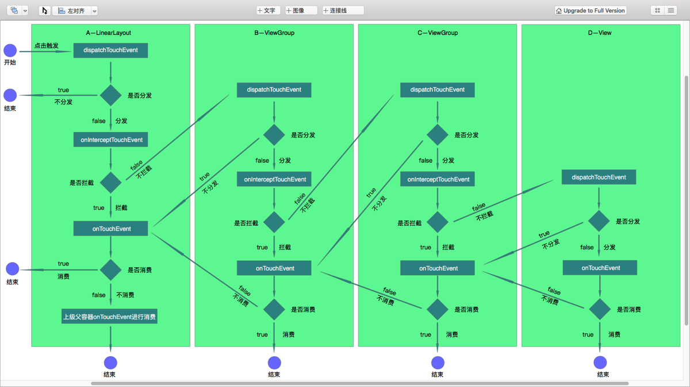
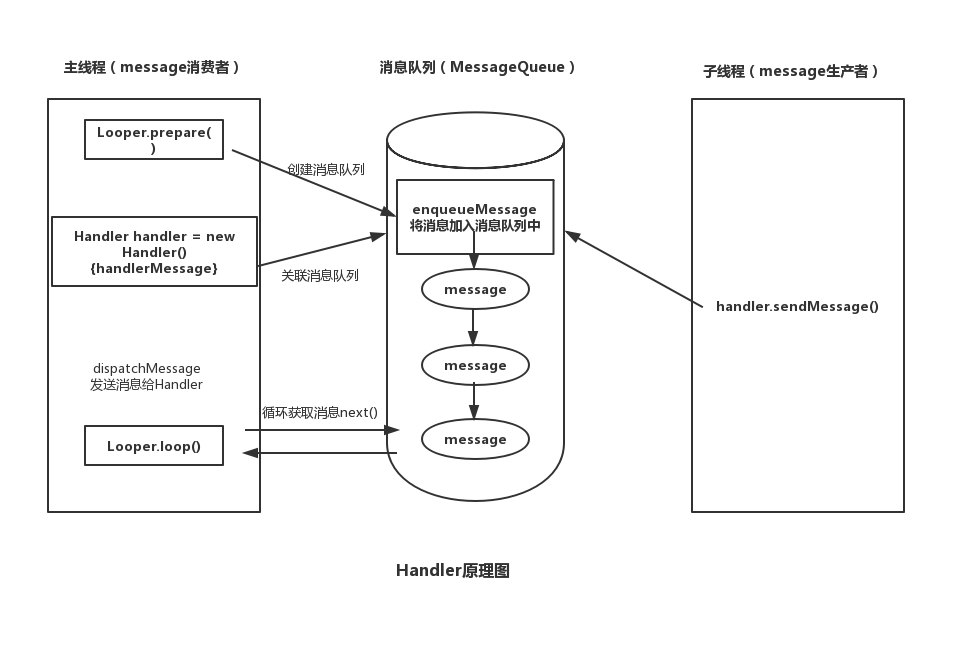
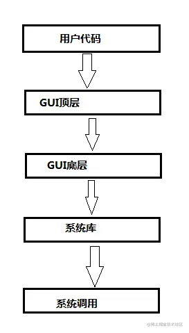
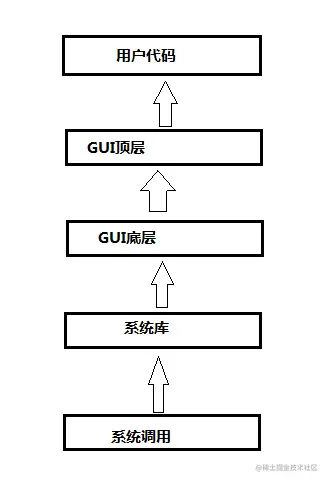
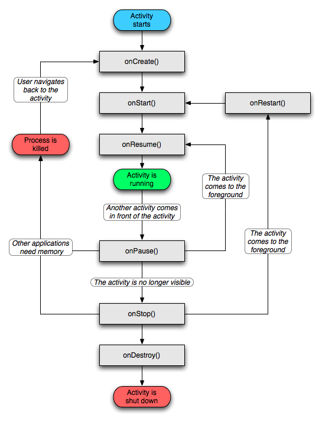
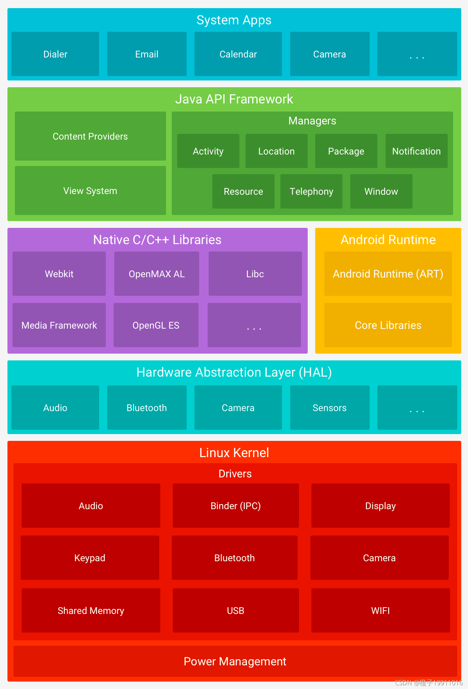

# Android

## Android四大组件

Activity：程序流程在其中运行，一个单独的窗口。

Service：在后台完成用户指定的操作。

ContentProvider：为所有应用准备一个内容窗口，保留数据库、文件。

BroadcastReceiver：程序之间传递信息时的一种机制，作用时接受或发送通知。

> Intent：一个强大的应用程序间的消息传递框架。Intent可以用来启动和停止Activity和Service，在系统范围内或向目标Activity、Service或Broadcast Receiver广播消息，以及请求对特定的一条数据执行操作。

## touch事件传递机制



事件从Activity界面开始，事件处理方法有两个`dispatchTouchEventon` 和 `TouchEvent `两种事件。每层`View/ViewGroup`可以选择是否对事件进行分发，如果不分发则会返回给上一层的`View/ViewGroup`。如果进行分发，会判断是否拦截事件，如果拦截则会判断是否进行消费，如果消费则结束，不消费则返回上层视图；如果不拦截则继续传递给下层视图，下层视图进行一样的操作。整个流程类似一个U型。

## 进程间通信

- 使用Bundle（Activity，Service，Receiver都支持在Intent中传递Bundle数据）单方向简单数据传输。
- 使用文件共享，读写同一个文件。有局限性，如并发读/写。
- 使用Messenger，轻量级方案，底层实现是AIDL，消息处理用Handler实现，以串行方式处理消息，不适合并发量大的场景。
- 使用AIDL，能直接调用服务端进程暴露的方法，能解决并发和跨进程调用，核心是Binder。
  - 定义一个AIDL接口
  - 为远程服务（Service）实现对应的Stub
  - 将服务暴露给客户程序使用
- 使用ContentProvider，不同应用之间进行数据交换的API，不管应用程序是否启动，都可以通过接口来操作接口内的数据。
- 使用Socket，一般是网络通信中使用的。

## 线程间通信方式

1. AsyncTask机制（适合短时间）
2. Handler机制。子线程中主动调用Looper.prepare(); 创建Handler（会与当前线程的Looper对象相关联）处理相应Message。Looper.loop()。

## Handler机制

Handler是Android中提供的一种异步回调机制，也可以理解为线程间的消息机制。为了避免ANR,我们通常会把一些耗时操作（比如：网络请求、I/O操作、复杂计算等）放到子线程中去执行，而当子线程需要修改UI时则子线程需要通知主线程去完成修改UI的操作，则此时就需要我们使用Handler机制来完成子线程与主线程之间的通信。其本质是消费者-生产者。



Looper创建时使用ThreadLocal，目的是保证每一个线程只创建唯一一个Looper。之后其他Handler初始化的时候直接获取第一个Handler创建的Looper。

大致总结：在子线程中Handler将消息发送到MessageQueue中，然后Looper不断的从MessageQueue中读取消息，并调用Handler的dispatchMessage发送消息，最后再Handler来处理消息。

- Looper ：**负责关联线程以及消息的分发**在该线程下从 MessageQueue 获取 Message，分发给 Handler ；
- MessageQueue ：**是个队列，负责消息的存储与管理**，负责管理由 Handler 发送过来的 Message ；
- Handler : **负责发送并处理消息**，面向开发者，提供 API，并隐藏背后实现的细节。

**Handler 发送的消息由 MessageQueue 存储管理，并由 Loopler 负责回调消息到 handleMessage()。**

**线程的转换由 Looper 完成，handleMessage() 所在线程由 Looper.loop() 调用者所在线程决定。**

### 使用方式

1. 在主线程中创建Handler实例，并且重写handlerMessage方法。

```java
private Handler handler = new Handler(){
 @Override
 public void handleMessage(Message msg) {
     switch (msg.what) {
         case 1:
            //执行相关修改UI的操作
             break;
        }
    }
 };
```

2. 子线程中获取Handler对象，在需要执行更新UI操作的地方使用handler发送消息

```java
Message msg = Message.obtain();
msg.obj = "content";
msg.what = 1;
//发送消息给Handler
handler.sendMessage(msg);  
```


### **GUI为什么设计成单线程？**

**多线程操作一个UI，很容易导致，或者极其容易导致反向加锁和死锁问题**

通过用户级的代码去改变界面，如`TextView.setText`走的是个**自顶向下**的流程；而系统底层发起的如**键盘事件**、**点击事件**走的是个自底向上的流程。



**为了避免死锁，每个流程都要走一样的加锁顺序，而GUI中的这两个流程却是完全相反的，如果每一层都有一个锁的话加锁就是个难以完成的任务了，而如果每一层都共用一个锁的话，那就跟单线程没区别了。即消息队列机制**

## Activity生命周期

1. onCreate():可以做一些初始化的工作，比如调用setContentView去加载界面布局资源、初始化Activity所需数据等。
2. onStart:表示Activity正在被启动，即将开始，这时Activity已经可见了，但是还没有出现在前台，还无法和用户交互。
3. onResume:表示Activity已经可见了，并且出现在前台并开始活动。 onStart和onResume都表示Activity已经可见，但是onStart的时候Activity还在后台，onResume的时候Activity才显示到前台。
4. onPause:表示Activity正在停止，正常情况下，紧接着onStop就会被调用。在特殊情况下，如果这个时候快速的再回到当前Activity，那么onResume就会被调用。此时可以做一些存储数据、停止动画等工作， 但是注意不能太耗时，因为这会影响到新的Activity的显示，onPause执行完，新的Activity的onResume才会执行。（在新的Activity需要先onPause后，新的Activity才能启动，所以是旧的Activity先onPause，然后新的Activity再启动）
5. onStop:表示Activity即将停止，可以做些稍微重量级的回收工作，同样不能太耗时。
6. onDestroy：表示Activity即将被销毁，这是Activity生命周期中的最后一个回调，可以做些回收工作和最终的资源释放。
7. onRestart:表示Activity正在重新启动。一般情况下，当当前Activity从不可见重新变为可见状态时，onRestart就会被调用。这种情形一般是用户行为所导致的，比如用户按Home按键切换到桌面或者用户打开了一个新的Activity，这时当前的Activity就会暂停，也就是onPause和onStop被执行了，接着用户又回到了这个Activity,就会出现这种情况。



## Android系统架构

Android 是谷歌开发的一款基于 Linux 内核的操作系统。**系统架构分为五层，从下到上依次是Linux内核层、硬件抽象层、系统运行库层、应用框架层和应用层。**



1. **Android 系统的核心系统服务基于 Linux 内核的，程序的安全性、网络协议、内存管理、进程管理、驱动程序都由 Linux 内核所提供。另外，Android Runtime（ART）就是依靠 Linux 内核来执行底层功能的，其中包括线程和低层内存管理。**

2. HAL硬件抽象层，其实可以不用这层，Linux内核采用GPL协议，任何人可以获取或修改源代码，因此Google增加了一层HAL存放不想公开的代码，一般是如何访问 Linux 内核就涉及到了技术专利和商业机密，厂商不想公开源代码，只愿提供二进制代码。

3. 系统运行库层：Android Runtime和Native C/C++库。

   **Android Runtime**

   分为核心库和ART（Android5.0之后）提供了Java语言核心库的大多数功能。ART主要功能：1.**预先编译**和即时编译；2.优化的垃圾回收；3.更好的调试支持。

   **Native C/C++库**

   许多核心的 Android 系统组件和服务（例如 ART 和 HAL）构建自原生代码，需要用 C/C++ 编写的原生库。

4. 应用框架层（Java API Framework）**应用框架层是为开发人员提供了开发应用程序所需要的 API，** 我们平时开发应用程序都是调用着一层所提供的 API ，当然也包括系统应用。**这一层是由`Java`代码编写的，可以称为`Java Framework`。**

5. 应用层，各种APP。