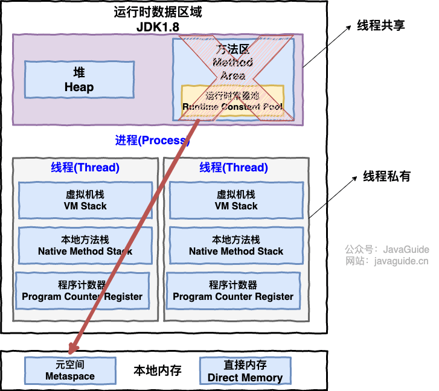
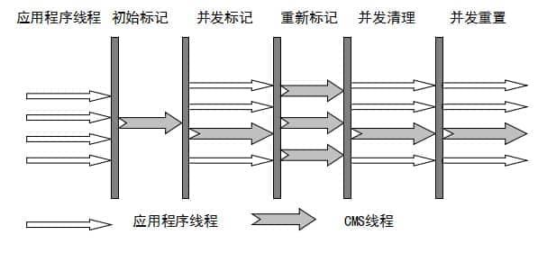

# JVM

## 运行时数据区

**程序计数器**：当前线程所执行的字节码的行号指示器。

**Java虚拟机栈**：实现Java方法调用，每一次方法调用会有对应栈帧压入栈。栈帧包含；局部变量表、操作数栈、动态链接、方法返回地址

**本地方法栈**：与虚拟栈类似，不过这里是调用Native方法

**堆**：**存放对象实例，几乎所有的对象实例和数组都在这里分配**

**方法区**：逻辑区域，各个线程共享的内存区域，方法区会存储已被虚拟机加载的 **类信息、字段信息、方法信息、常量、静态变量、即时编译器编译后的代码缓存等数据**。JDK1.8以后，方法区的实现变为元空间（原来是永久代）

运行时常量池：在方法区中，存放编译期生成的各种字面量（Literal）和符号引用（Symbolic Reference）的 **常量池表(Constant Pool Table)** 。

字符串常量池：现在移动到堆中，存放字符串。

## 类加载过程

将class文件加载到内存中，并对数据进行校验，转换解析和初始化，最终形成可被java虚拟机直接使用的java类 

加载——连接（验证、准备、解析）——初始化——使用——卸载 

1. 加载：根据String类名进行装载 

2. 验证：查看类是否安全，是否违背jvm的规定

   准备：准备分配类中变量所需要的内存空间，并初始化变量值

   解析：将常量池内的符号引用（一串符号）替换成直接引用（真正指向目标的指针） 

3. 初始化：真正进行java程序的运行，对类进行初始化

## 对象加载过程

**Step1:类加载检查**

虚拟机遇到一条 new 指令时，首先将去检查这个指令的参数是否能在常量池中定位到这个类的符号引用，并且检查这个符号引用代表的类是否已被加载过、解析和初始化过。如果没有，那必须先执行相应的类加载过程。

**Step2:分配内存**

在**类加载检查**通过后，接下来虚拟机将为新生对象**分配内存**。对象所需的内存大小在类加载完成后便可确定，为对象分配空间的任务等同于把一块确定大小的内存从 Java 堆中划分出来。**分配方式**有 **“指针碰撞”** 和 **“空闲列表”** 两种，**选择哪种分配方式由 Java 堆是否规整决定，而 Java 堆是否规整又由所采用的垃圾收集器是否带有压缩整理功能决定**。

**内存分配的两种方式** （补充内容，需要掌握）：

- 指针碰撞 ： 
  - 适用场合 ：堆内存规整（即没有内存碎片）的情况下。
  - 原理 ：用过的内存全部整合到一边，没有用过的内存放在另一边，中间有一个分界指针，只需要向着没用过的内存方向将该指针移动对象内存大小位置即可。
  - 使用该分配方式的 GC 收集器：Serial, ParNew
- 空闲列表 ： 
  - 适用场合 ： 堆内存不规整的情况下。
  - 原理 ：虚拟机会维护一个列表，该列表中会记录哪些内存块是可用的，在分配的时候，找一块儿足够大的内存块儿来划分给对象实例，最后更新列表记录。
  - 使用该分配方式的 GC 收集器：CMS

选择以上两种方式中的哪一种，取决于 Java 堆内存是否规整。而 Java 堆内存是否规整，取决于 GC 收集器的算法是"标记-清除"，还是"标记-整理"（也称作"标记-压缩"），值得注意的是，复制算法内存也是规整的。

**内存分配并发问题（补充内容，需要掌握）**

在创建对象的时候有一个很重要的问题，就是线程安全，因为在实际开发过程中，创建对象是很频繁的事情，作为虚拟机来说，必须要保证线程是安全的，通常来讲，虚拟机采用两种方式来保证线程安全：

- **CAS+失败重试：** CAS 是乐观锁的一种实现方式。所谓乐观锁就是，每次不加锁而是假设没有冲突而去完成某项操作，如果因为冲突失败就重试，直到成功为止。**虚拟机采用 CAS 配上失败重试的方式保证更新操作的原子性。**
- **TLAB：** 为每一个线程预先在 Eden 区分配一块儿内存，JVM 在给线程中的对象分配内存时，首先在 TLAB 分配，当对象大于 TLAB 中的剩余内存或 TLAB 的内存已用尽时，再采用上述的 CAS 进行内存分配

**Step3:初始化零值**

内存分配完成后，虚拟机需要将分配到的内存空间都初始化为零值（不包括对象头），这一步操作保证了对象的实例字段在 Java 代码中可以不赋初始值就直接使用，程序能访问到这些字段的数据类型所对应的零值。

**Step4:设置对象头**

初始化零值完成之后，**虚拟机要对对象进行必要的设置**，例如这个对象是哪个类的实例、如何才能找到类的元数据信息、对象的哈希码、对象的 GC 分代年龄等信息。 **这些信息存放在对象头中。** 另外，根据虚拟机当前运行状态的不同，如是否启用偏向锁等，对象头会有不同的设置方式。

**Step5:执行 init 方法**

在上面工作都完成之后，从虚拟机的视角来看，一个新的对象已经产生了，但从 Java 程序的视角来看，对象创建才刚开始，`<init>` 方法还没有执行，所有的字段都还为零。所以一般来说，执行 new 指令之后会接着执行 `<init>` 方法，把对象按照程序员的意愿进行初始化，这样一个真正可用的对象才算完全产生出来。

### 对象内存布局

对象在内存中的布局可以分为 3 块区域：**对象头**、**实例数据**和**对齐填充**。

**Hotspot 虚拟机的对象头包括两部分信息**，**第一部分用于存储对象自身的运行时数据**（哈希码、GC 分代年龄、锁状态标志等等），**另一部分是类型指针**，即对象指向它的类元数据的指针，虚拟机通过这个指针来确定这个对象是哪个类的实例。

**实例数据部分是对象真正存储的有效信息**，也是在程序中所定义的各种类型的字段内容。

**对齐填充部分不是必然存在的，也没有什么特别的含义，仅仅起占位作用。**

### 对象访问定位

一种是**句柄**，一种是直接指针。使用句柄来访问的最大好处是 reference 中存储的是稳定的句柄地址，在对象被移动时只会改变句柄中的实例数据指针，而 reference 本身不需要修改。使用直接指针访问方式最大的好处就是速度快，它节省了一次指针定位的时间开销。HotSpot采用的是**直接指针**的对象访问方式

## **类的加载器，双亲委派模型**

1. 实现类加载这个动作的代码模块叫做类加载器。 

2. 一个类是由**加载他的类加载器**和**这个类本身**共同确定其在java虚拟机中的**唯一性。两个类相同必须确保他们的类加载器是相同的** 

3. 双亲委派模型描述了类加载器之间的层次关系：**启动类加载器<--扩展类加载器<--应用类加载器<--自定义类加载器** 

4. 双亲委派模型要求：除了启动类加载器，其他的类加载器必须都有一个父类加载器（父子关系通过组合实现，不是继承，因为 classLoader是final修饰的，不能被继承） 

5. 双亲委派模型工作流程：当一个类加载器收到类加载的请求，先把请求委派给父类加载器完成，每一层都是这样，也就是最终都会委 派给启动类加载器。只有父类加载器无法完成类加载请求时（搜索范围内找不到需要的类），才会让子类加载器来完成类加载 

**好处**

java对象随着类加载器有了一种类加载的优先级层级关系，可以保证与java自身类库重名的类不会被加载。如果没有双亲委派模型，由类加载器自行加载，如果用户编写了一个java.lang.Object类，那将会出现多个java.lang.Object类，造成混乱。

## 堆和栈的区别

1. 堆用于存储实例化的对象和数组，是线程共享的；栈用于存储局部变量和方法调用，实现线程私有的 

2. 栈内存远远小于堆内存 

3. 栈内存的更新速度要快于堆内存，因为局部变量的生命周期很短 

4. 栈内存存放的变量的生命周期一旦结束，内存就会被释放；堆内存存放的实体会被垃圾回收机制不定时回收 

## JVM垃圾回收

### 垃圾收集算法

1. 标记-清除：缺点：效率低，而且会产生内存碎片

2. 标记-复制：优点：简单高效，不会有内存碎片，缺点：内存利用率低。适用于年轻代对象存活率低的情况 

3. 标记-整理：优点：解决内存不连续的问题，也解决复制算法内存利用率低的问题，缺点：效率不高。适用于老年代对象 存活率高的情况 

4. 分代收集算法（采用）

   年轻代：采用标记-复制算法（只有少量对象存活，每次只需要复制少量对象即可完成收集）

   老年代：采用标记-整理算法（有大量对象存活，不适合采用复制算法，内存代价太高）

### 内存分配和回收原则

1. 对象现在Eden区分配内存

2. 大对象直接进入老年代

3. 长期存活的对象将进入老年代。在Eden出生经过第一次Minor GC后仍能存活，就会移到Survivor空间（S0或S1）然后设置对象年龄为1，Survivor中每熬过一次MinorGC就增加一岁，达到一定程度晋升到老年代中。

### 死亡对象判断方法

1. 引用计数法（不用）：有循环引用问题 

2. 可达性分析法（采用）：以一系列GC root对象作为起点向下搜索，所走过的路径称为引用链，如果GC root对象到某个对象不可达，即此对象不在引用链上，则此对象可回收 

**GC root有哪些？** 

1. 虚拟机栈中的局部变量表引用的对象
2. 本地方法栈引用的对象
3. 方法区中类静态变量和常量引用的对象

### 什么时候触发MinorGC？什么时候FullGC？

**触发MinorGC（YoungGC）**

自动触发机制只有一个  **Eden区没有足够的空间分配给新创建的对象**。

**触发FullGC**

- 老年代空间不足

  如果创建一个大对象，Eden区域当中放不下这个大对象，会直接保存在老年代当中，如果老年代空间也不足，就会触发Full GC。为了避免这种情况，最好就是不要创建太大的对象。 

- 永久代空间不足 

  如果有永久代空间的话，系统当中需要加载的类，调用的方法很多，同时永久代当中没有足够的空间，就出触发一次Full GC 

- YGC出现promotion failure 

  promotion failure发生在Young GC, 如果Survivor区当中存活对象的年龄达到了设定值，会就将Survivor区当中的对象拷贝到老年代，如果老年代的空间不足，就会发生promotion failure， 接下去就会发生Full GC. 

- 统计YGC发生时晋升到老年代的平均总大小大于老年代的空闲空间 

  在发生YGC是会判断，是否安全，这里的安全指的是，当前老年代空间可以容纳YGC晋升的对象的平均大小，如果不安全，就不会执行YGC,转而执行Full GC。 

- 显式调用System.gc

## 垃圾收集器

### Serial收集器

Serial（串行）收集器，使用一跳垃圾收集线程区完成垃圾收集工作，收集时会暂停其他所有工作线程（“Stop the World”）。**新生代采用标记-复制算法，老年代采用标记-整理算法。**

### ParNew收集器

**Serial 收集器的多线程版本**，采用多线程进行垃圾收集，其他都一样。

### Serial Old 收集器

**Serial 收集器的老年代版本**，它同样是一个单线程收集器。它主要有两大用途：一种用途是在 JDK1.5 以及以前的版本中与 Parallel Scavenge 收集器搭配使用，另一种用途是作为 CMS 收集器的后备方案。

### Parallel Old 收集器

**Parallel Scavenge 收集器的老年代版本**。使用多线程和“标记-整理”算法。在注重吞吐量以及 CPU 资源的场合，都可以优先考虑 Parallel Scavenge 收集器和 Parallel Old 收集器。

### CMS收集器

CMS（Concurrent Mark Sweep）收集器是一种**以获取最短回收停顿时间为目标**的收集器。它非常符合在**注重用户体验的应用上使用**。

**CMS（Concurrent Mark Sweep）收集器是 HotSpot 虚拟机第一款真正意义上的并发收集器，它第一次实现了让垃圾收集线程与用户线程（基本上）同时工作。**CMS是一种**“标记-清除”算法**实现的，它对**新生代还是采用标记-复制算法**。整个过程分为四个步骤：

- **初始标记：** 暂停所有的其他线程，并记录下直接与 root 相连的对象，速度很快 ；
- **并发标记：** 同时开启 GC 和用户线程，用一个闭包结构去记录可达对象。但在这个阶段结束，这个闭包结构并不能保证包含当前所有的可达对象。因为用户线程可能会不断的更新引用域，所以 GC 线程无法保证可达性分析的实时性。所以这个算法里会跟踪记录这些发生引用更新的地方。【三色标记】
- **重新标记：** 重新标记阶段就是为了修正并发标记期间因为用户程序继续运行而导致标记产生变动的那一部分对象的标记记录，这个阶段的停顿时间一般会比初始标记阶段的时间稍长，远远比并发标记阶段时间短
- **并发清除：** 开启用户线程，同时 GC 线程开始对未标记的区域做清扫。

### G1收集器

**G1 (Garbage-First) 是一款面向服务器的垃圾收集器,主要针对配备多颗处理器及大容量内存的机器. 以极高概率满足 GC 停顿时间要求的同时,还具备高吞吐量性能特征.**它具有以下几个特点

- **并行与并发**：G1 能充分利用 CPU、多核环境下的硬件优势，使用多个 CPU（CPU 或者 CPU 核心）来缩短 Stop-The-World 停顿时间。部分其他收集器原本需要停顿 Java 线程执行的 GC 动作，G1 收集器仍然可以通过并发的方式让 java 程序继续执行。
- **分代收集**：虽然 G1 可以不需要其他收集器配合就能独立管理整个 GC 堆，但是还是保留了分代的概念。
- **空间整合**：与 CMS 的“标记-清除”算法不同，G1 从整体来看是基于**“标记-整理”算法**实现的收集器；从局部上来看是基于“标记-复制”算法实现的。
- **可预测的停顿**：这是 G1 相对于 CMS 的另一个大优势，降低停顿时间是 G1 和 CMS 共同的关注点，但 G1 除了追求低停顿外，还能建立可预测的停顿时间模型，能让使用者明确指定在一个长度为 M 毫秒的时间片段内。

G1 收集器的运作大致分为以下几个步骤：

- **初始标记**
- **并发标记**
- **最终标记**
- **筛选回收**

**G1 收集器在后台维护了一个优先列表，每次根据允许的收集时间，优先选择回收价值最大的 Region(这也就是它的名字 Garbage-First 的由来)** 。这种使用 Region 划分内存空间以及有优先级的区域回收方式，保证了 G1 收集器在有限时间内可以尽可能高的收集效率（把内存化整为零

### ZGC收集器

与 CMS 中的 ParNew 和 G1 类似，ZGC 也采用标记-复制算法，不过 ZGC 对该算法做了重大改进。在 ZGC 中出现 Stop The World 的情况会更少！

### G1和CMS的区别

Sleep和wait
