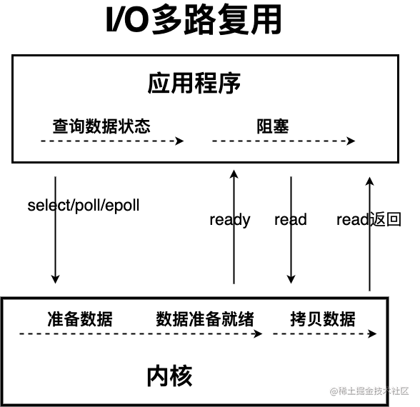

# Java IO模型详解

## 什么是I/O？

I/O即输出/输出，从计算机结构解读：根据冯.诺伊曼结构，计算机分为**输入设备、控制器、运算器、存储器、输出设备**。

故，从计算机结构的视角来看，I/O描述了计算机系统与外部设备之间通信的过程。

从应用程序角度解读：为了保证操作系统的稳定性和安全性，一个进程的地址空间分为**用户空间**和**内核空间**，平常运行的应用程序都是运行在用户空间，只有内核空间才能进行系统态级别的资源有关操作，如文件管理、进程通信、内存管理等。故用户进程想要执行IO操作，需要通过**系统调用**来间接访问内核空间。平常开发接触最多的是**磁盘IO**和**网络IO**

**从应用程序的视角来看的话，我们的应用程序对操作系统的内核发起 IO 调用（系统调用），操作系统负责的内核执行具体的 IO 操作。也就是说，我们的应用程序实际上只是发起了 IO 操作的调用而已，具体 IO 的执行是由操作系统的内核来完成的。**

当应用程序发起 I/O 调用后，会经历两个步骤：

1. 内核等待 I/O 设备准备好数据
2. 内核将数据从内核空间拷贝到用户空间。

## Java常见的IO模型

UNIX系统下，IO模型共有五种：**同步阻塞 I/O**、**同步非阻塞 I/O**、**I/O 多路复用**、**信号驱动 I/O** 和**异步 I/O**。

### BIO（Blocking I/O）

BIO属于同步阻塞I/O，应用发起read调用后，一直阻塞直到内核把数据拷贝到用户空间

面对十万甚至百万级连接的时候，传统BIO模型是无能为力。

### NIO（Non-blocking/New I/O）

Java的NIO可以看作是I/O多路复用模型。首先看传统 **同步非阻塞模型**

同步非阻塞 IO 模型中，应用程序会一直发起 read 调用，等待数据从内核空间拷贝到用户空间的这段时间里，线程依然是阻塞的，直到在内核把数据拷贝到用户空间。

相比于同步阻塞 IO 模型，同步非阻塞 IO 模型确实有了很大改进。通过轮询操作，避免了一直阻塞。

但是，这种 IO 模型同样存在问题：**应用程序不断进行 I/O 系统调用轮询数据是否已经准备好的过程是十分消耗 CPU 资源的。**

这个时候，**I/O 多路复用模型** 就上场了。

IO多路复用模型中，线程首先发起select调用，询问内核数据是否准备就绪，等内核把数据准备好，用户线程再发起read调用。read调用的过程（数据从内核空间 -> 用户空间）还是阻塞的。

> 目前支持 IO 多路复用的系统调用，有 select，epoll 等等。select 系统调用，目前几乎在所有的操作系统上都有支持。
>
> - **select 调用** ：内核提供的系统调用，它支持一次查询多个系统调用的可用状态。几乎所有的操作系统都支持。
>
> - **epoll 调用** ：linux 2.6 内核，属于 select 调用的增强版本，优化了 IO 的执行效率。

**IO 多路复用模型，通过减少无效的系统调用，减少了对 CPU 资源的消耗。**

Java 中的 NIO ，有一个非常重要的**选择器 ( Selector )** 的概念，也可以被称为 **多路复用器**。通过它，只需要一个线程便可以管理多个客户端连接。当客户端数据到了之后，才会为其服务。

### AIO（Asynchronous I/O）

AIO也就是NIO 2。Java 7中引入了，它是异步IO模型，基于事件和回调机制实现的，也就是应用操作以后会直接返回，不会堵塞，当内核处理完成，操作系统会通知相应线程继续后续操作。

## select、poll、epoll

### select

select把所有管理的**socket的fd**（Linux下皆为文件，简单理解即通过fd能找到这个socket）传入内核中【内核才有权限】，遍历所有socket，查看是否有事件发生，如果都没有则让出cpu阻塞等待，可以不设时间死等，也可以超时等待。

当客户端发送数据，**socket对应的接收队列**收到消息，需要唤醒select。如何唤醒？每个socket有自己的睡眠队列，里面有一个**select的entry（内鬼！）**，socket收到数据就去睡眠队列遍历entry，调用entry的callback方法唤醒select。

此时唤醒的select只知道来活了，不知道具体是哪个socket，**只能遍历全部的socket**，将来活的socket封装成事件返回。

### poll

主要是优化了fds的结构，上面select的fd是bit数组，poll改成了**pollfd**，没有1024大小的限制，现在用的不多。

### epoll

select有两个可以优化的点：

1. 每次select需要把监控的fd传到内核中，不能在内核中维护吗？

2. socket每次只唤醒select，不能告诉它哪个socket来数据了？

epoll主要基于上面两点优化了。搞了个**epoll_ctl**，管理维护epoll所监控的socket，添加删除都通过epoll_ctl，通过不同的入参来控制。

这样，内核中维护了此epoll管理的socket集合，不用每次拷贝fd到内核了。这个**socket集合是用红黑树实现**的，与select类似，每个socket睡眠队列里加个entry，当socket来数据后调用entry的callback。不过epoll引入了ready_list双向链表，callback会**把当前的socket加入到这个ready_list**然后唤醒。同时，收集到的fd按理是要拷贝到用户空间的，这里做了个优化，利用了**mmp让用户空间和内核空间映射到同一块内存**中，这样就避免了拷贝。

### ET、LT

**ET（边沿触发）**

按照上面的逻辑就是 epoll 遍历 ready_list 的时候，会把 socket 从 ready_list 里面移除，然后读取这个 scoket 的事件。

**LT（水平触发）**

在这个模式下 epoll 遍历 ready_list 的时候，会把 socket 从 ready_list 里面移除，然后读取这个 scoket 的事件，如果这个 socket 返回了感兴趣的事件，那么当前这个 socket 会再被加入到 ready_list 中，这样下次调用 epoll_wait 的时候，还能拿到这个 socket。

**举例**

如果此时一个客户端同时发来了 5 个数据包，按正常的逻辑，只需要唤醒一次 epoll ，把当前 socket 加一次到 ready_list 就行了，不需要加 5 次。然后用户程序可以把 socket 接收队列的所有数据包都读完。

但假设用户程序就读了一个包，然后处理报错了，后面不读了，那后面的 4 个包咋办？

如果是 ET 模式，就读不了了，因为没有把 socket 加入到 ready_list 的触发条件了。**除非这个客户端发了新的数据包过来**，这样才会再把当前 socket 加入到 ready_list，在新包过来之前，这 4 个数据包都不会被读到。

而 LT 模式不一样，因为每次读完有感兴趣的事件发生之后，会把当前 socket 再加入到 ready_list，所以下次肯定能读到这个 socket，所以后面的 4 个数据包会被访问到，**不论客户端是否发送新包**。

# 参考资料

1. [JavaGuide](https://javaguide.cn/java/io/io-model.html#%E5%89%8D%E8%A8%80)
2. [彻底搞懂 select/poll/epoll，就这篇了！](https://mp.weixin.qq.com/s?__biz=MzkxNTE3NjQ3MA==&mid=2247494670&idx=1&sn=3aa5a8a13b8a40eddf1a1e5012e987f0&chksm=c1618177f6160861569e0587cb8495cdf1a93c68c087c73c8bb4c759b30f26eb43a8f25fe941&mpshare=1&scene=23&srcid=0617zga4oTRUOnG8UQz1AtZn&sharer_sharetime=1655445765662&sharer_shareid=fef2e677b8dd3654b49985aaa66fad0e#rd)

