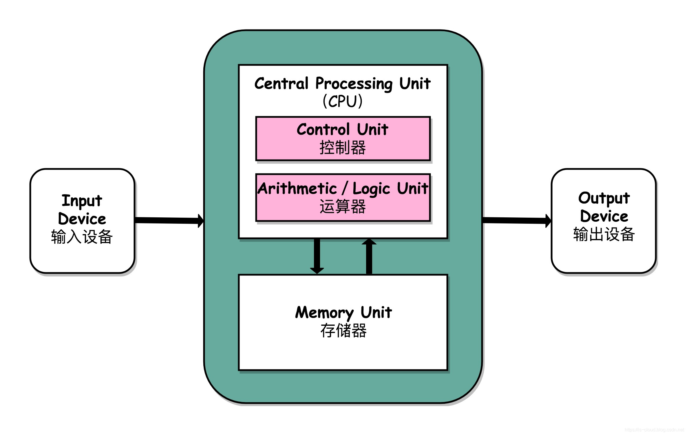
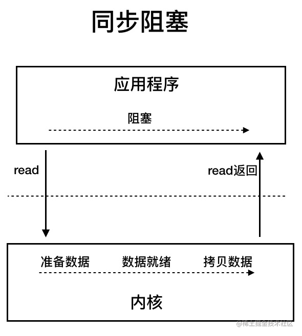
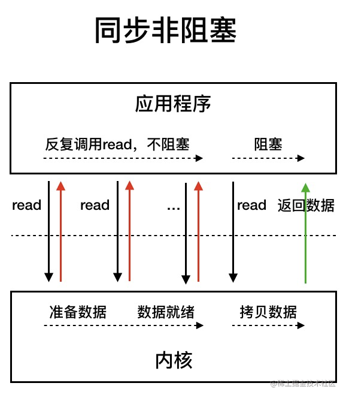

# Java基础

## 基础概念

### 什么是字节码

.class文件就是字节码，java程序从源代码到运行的过程如下图：


一开始，JVM加载字节码文件通过解释器逐行解释执行，后面引入JIT，**JIT（just-in-time）属于运行时编译**，完成第一次编译后会保存字节码对应的机器码。


### Java中只有值传递

Java 中将实参传递给方法（或函数）的方式是 **值传递** ：

- 如果参数是基本类型的话，很简单，传递的就是基本类型的字面量值的拷贝，会创建副本。
- 如果参数是引用类型，传递的就是实参所引用的对象在**堆中地址值**的拷贝，同样也会创建副本。

### equals和==

**equals**

- 默认情况下比较的是地址值。
- 在String类型和基本数据类型的包装类中，equals方法被重写，重写后比较的是两者之间的内容。

**==**

- ==比较变量时，比较的是内容
- 比较对象是，则是对地址的比较。

### **final**

1. 修饰属性、基本类型表示值不可修改，引用类型表示引用不可变，对象具体值可变，必须要初始化，初始化之后不能再重新赋值 。

2. 修饰方法，表示方法不可重写 

3. 修饰类，表示类不可被继承，默认类中的方法和属性全部为final 

### Exception和Error的区别

两者的父类都是throwable类。 

error：一般是指和jvm相关的错误，如系统崩溃、内存不足、方法栈溢出、jvm错误。对于这类错误，建议让程序终止 

exception：一般是程序可以处理的异常，可以catch且可以恢复。对于这类exception，应尽量catch并恢复，而不是终止程序 

### Java的四种引用类型【重点】

- **强引用**：我们常常 new 出来的对象就是强引用类型，只要强引用存在，垃圾回收器将永远不会回收被引用的对象，哪怕内存不足的时候
- **软引用**：使用 SoftReference 修饰的对象被称为软引用，软引用指向的对象在内存要溢出的时候被回收
- **弱引用**：使用 WeakReference 修饰的对象被称为弱引用，只要发生垃圾回收，若这个对象只被弱引用指向，那么就会被回收
- **虚引用**：虚引用是最弱的引用，在 Java 中使用 PhantomReference 进行定义。虚引用中唯一的作用就是用队列接收对象即将死亡的通知

### String相关面试问题

1. **String是基本数据类型吗？**

   String不是基本的数据类型，它属于对象，基本数据类型有8种，整型byte、int、short、long；浮点型float、double；字符型char；布尔boolean 

2. **String可以被继承吗？是可变的吗？**

   String不可以被继承，因为是final修饰的，它被设计成不可变类，故不可变，体现在如String s = "hello"; s += "world!" s的指向内存起始地址已经改变。如果是自己声明的对象，如user包含name、age属性，name和age的值可以改变，但是声明的user引用执行的地址是不变的，而String类型的引用执行的起始地址会变化，就导致只要值改变了，String就是新的对象，造成内存开销，所以有了StringBuffer和StringBuilder 

3. **String、StringBuffer、StringBuilder之间的区别？** 

   String和StringBuffer、StringBuilder的区别：String声明的是不可变的对象，每次操作会生成新的String对象，而另外两个可以在原有对象的基础伤操作，所以需要经常改变字符串内容的情况最好不要用String。 StringBuffer、StringBuilder的区别：StringBuffer是线程安全的，StringBuilder不是，因而在多线程环境下需要使用StringBuffer 

4. **String str = "i" 和String str = new String("i")一样吗？** 

   不一样，String str = "i" 的方式，java虚拟机会将其分配到字符串常量池中，new String是声明在堆内存中 

5. **String str = new String("i")创建了几个对象？** 

   两个，先创建"i"在字符串常量池中，通过new 又创建在堆中 

6. **String和byte[]如何转换？** 

   String.getBytes() 和newString(byte[])

### AutomicInteger的实现原理

1. 原子性操作：AtomicInteger提供了一系列的原子性操作方法，如`get()`、`set()`、`incrementAndGet()`、`decrementAndGet()`等。这些方法都是原子操作，底层使用了CAS（Compare and Swap）算法，确保在多线程环境下对整数的操作是原子的，不会被其他线程中断或干扰。
2. 内存可见性：AtomicInteger使用了volatile关键字来保证多线程之间的内存可见性。当一个线程修改AtomicInteger的值时，会立即将修改后的值刷新到主内存中，其他线程可以立即看到这个修改。
3. 无锁机制：AtomicInteger使用了CAS算法来实现原子操作，而CAS是一种无锁机制，不需要使用传统的锁机制（如synchronized）来实现线程安全。CAS利用CPU的原子指令来实现对内存值的比较和修改，避免了线程阻塞和上下文切换的开销，提高了并发性能。

## 面向对象基础

### 【重要】面向对象三大特征

**封装、继承、多态**

- **封装**：将一个对象的状态信息（就是属性）封装在对象内部，不允许外部对象直接访问对象内部信息，但可以提供一些方法。

- **继承**：描述类和类之间的关系，使用已有类作为新类的基础，新类可以拓展，也可以使用父类功能。提高代码重用，增加可维护性。

  特别的：

  1. 子类拥有父类对象所有的属性和方法（包括私有属性和私有方法），但是父类中的私有属性和方法子类是无法访问，**只是拥有**。

  2. 子类可以拥有自己属性和方法，即子类可以对父类进行扩展。

  3. 子类可以用自己的方式实现父类的方法。

- **多态**：表示一个对象具有多种的状态，简单的说就是“一个函数，多种实现”，或是“一个接口，多种方法”。多态性表现在程序运行时根据传入的对象调用不同的函数。实现多态有两种方式：重写（覆盖），重载。【下面有介绍重写重载】

### 重载和重写

**重载**：方法名一样，参数不一样。

**重写**：子类重写父类方法。

### 深拷贝、浅拷贝和引用拷贝

浅拷贝：**会在堆上建立一个新的对象（区别于引用拷贝）**，如果原对象内部属性是**引用类型**的话，浅拷贝会直接复制内部对象的引用地址，就是说拷贝对象和原对象共用一个内部对象。

深拷贝：会完全复制整个对象，包括这个对象所包含的内部对象。

引用拷贝：**两个不同的引用指向同一个对象。**


### 接口和抽象类

**共同点**

1.都不能被实例化 2.都可以包含抽象方法 3.可以有默认实现的方法

**区别**

1. 接口是对类行为的进行约束，实现接口就有对应的行为；抽象类主要用于代码复用，强调从属关系。

2. 一个类只能继承一个类，可以实现多个接口
3. 接口中的成员只能是`public static final`类型的，**不能被修改且必须有初始值**，抽象类可以在子类被重新定义和赋值。

### 面向对象基本原则

1. **单一职责原则**（Single Responsibility Principle，SRP）：一个类应该只有一个引起它变化的原因。换句话说，一个类应该只有一个职责。这样可以提高类的内聚性，使得类更加易于理解、修改和维护。
2. **开放封闭原则**（Open-Closed Principle，OCP）：软件实体（类、模块、函数等）应该对扩展开放，对修改关闭。即通过扩展现有的实体来实现变化，而不是修改已有的代码。这样可以减少对现有代码的影响，提高代码的可维护性和可扩展性。
3. **里氏替换原则**（Liskov Substitution Principle，LSP）：子类对象应该能够替换父类对象，而程序的行为不会受到影响。也就是说，子类应该能够完全地替代父类，而不引发错误或破坏程序的正确性。
4. **接口隔离原则**（Interface Segregation Principle，ISP）：客户端不应该依赖它不需要使用的接口。接口应该细化，保持单一职责，并且客户端只需要使用它们需要的接口。这样可以避免接口的臃肿和冗余，提高系统的灵活性和可维护性。
5. **依赖倒置原则**（Dependency Inversion Principle，DIP）：高层模块不应该依赖低层模块，两者都应该依赖于抽象。抽象不应该依赖细节，而细节应该依赖抽象。这样可以降低模块之间的耦合度，提高系统的可扩展性和可维护性。
6. **迪米特法则**（Law of Demeter，LoD）：也称为最少知识原则（Least Knowledge Principle，LKP）。一个对象应该对其他对象有尽可能少的了解，只与直接的朋友通信。也就是说，一个对象只应该与它的成员变量、方法参数、方法返回值以及它所创建的对象进行交互，而不应该了解其他对象的内部细节。

## 泛型

### 什么是泛型？

泛型，即“参数化类型”，最熟悉的就是定义方法时有形参，然后调用此方法时传递实参。

### 为什么说java是伪泛型？

泛型擦除：Java 语言中的泛型，它只在程序源码中存在，在编译后的字节码文件中，就已经替换为原来的原生类型（Raw Type，也称为裸类型），并且在相应的地方插入了强制转型代码。对于运行期的 Java 语言来说，ArrayList＜int＞与 ArrayList＜String＞就是同一个类。泛型技术实际上是 Java 语言的一颗语法糖，**Java 语言中的泛型实现方法称为类型擦除，基于这种方法实现的泛型称为伪泛型。**

### 泛型的好处？

1. 类型安全：泛型可以帮助我们在编译时就发现类型不匹配的错误，避免了等到运行时才发现的尴尬。

2. 可读性：使用泛型可以让程序的代码更加简洁明了，减少了类型转换的代码，使程序更容易阅读和维护。

3. 代码复用：泛型可以使我们的代码更具有通用性，可以使一个类或方法具有更广泛的适用性，从而减少了冗余代码的编写。

4. 性能提高：泛型可以消除许多强制类型转换，从而在性能上获得提升。

5. 兼容性：泛型可以让我们的代码更加兼容不同的数据类型和版本。

### 基本数据类型可以作为泛型吗？

不可以。泛型通过类型擦除来实现，基本数据类型在擦除后无法转换成对象类型。可以用对应的包装类实现。

## 反射

### 【重要】什么是反射？

在运行状态runTime下，对于任意一个类，都可以获取到它的所有方法和属性；对于任意一个对象，都可以调用它的所有方法和属性，**这种动态调用对象的方法和动态获取类的信息的功能叫做反射机制**。

### 反射的应用场景？

**各种框架如Spring/SpringBoot、MyBatis**等，大量使用了反射机制。这些框架大量使用了**动态代理**，动态代理的实现依赖于**反射**。另外，Java中**注解**的实现也用到了反射。基于反射分析类，然后获取到类/属性/方法/方法的参数上的注解。获取到注解之后，就可以做进一步的处理。

### 反射的优缺点

优点：灵活性、扩展性、降低耦合性，提高自适应能力。 

缺点：性能低，因为需要在runtime下动态解释，并不是提前编译完成的。

### 反射实战

**获取类对象的四种方式**

```Java
Class alunbarClass = TargetObject.class;// 知道具体类
Class alunbarClass1 = Class.forName("com.hwhhhh.TargetObject");//通过传入类的全路径
Class alunbarClass2 = o.getClass();// 通过对象实例o获取
Class alunbarClass3 = ClassLoader.getSystemClassLoader().loadClass("com.hwhhhh.TargetObject");//传入类路径
```

**操作方法和参数**

```java
package cn.javaguide;

import java.lang.reflect.Field;
import java.lang.reflect.InvocationTargetException;
import java.lang.reflect.Method;

public class Main {
    public static void main(String[] args) throws ClassNotFoundException, NoSuchMethodException, IllegalAccessException, InstantiationException, InvocationTargetException, NoSuchFieldException {
        /**
         * 获取 TargetObject 类的 Class 对象并且创建 TargetObject 类实例
         */
        Class<?> targetClass = Class.forName("com.hwhhhh.TargetObject");
        TargetObject targetObject = (TargetObject) targetClass.newInstance();
        /**
         * 获取 TargetObject 类中定义的所有方法
         */
        Method[] methods = targetClass.getDeclaredMethods();
        for (Method method : methods) {
            System.out.println(method.getName());
        }

        /**
         * 获取指定方法并调用
         */
        Method publicMethod = targetClass.getDeclaredMethod("publicMethod",
                String.class);

        publicMethod.invoke(targetObject, "JavaGuide");

        /**
         * 获取指定参数并对参数进行修改
         */
        Field field = targetClass.getDeclaredField("value");
        //为了对类中的参数进行修改我们取消安全检查
        field.setAccessible(true);
        field.set(targetObject, "JavaGuide");

        /**
         * 调用 private 方法
         */
        Method privateMethod = targetClass.getDeclaredMethod("privateMethod");
        //为了调用private方法我们取消安全检查
        privateMethod.setAccessible(true);
        privateMethod.invoke(targetObject);
    }
}
```

## 代理模式

简单来说就是**使用代理对象来代替对真实对象(real object)的访问，这样就可以在不修改原目标对象的前提下，提供额外的功能操作，扩展目标对象的功能。**

代理模式的主要作用是**扩展目标对象的功能，比如说在目标对象的某个方法执行前后可以增加一些自定义的操作。**

### 静态代理

静态代理中，对目标对象的每个方法增强都是手动完成，较不灵活且麻烦（如接口新增方法，目标对象和代理对象都要修改；对每个目标类都要单独写一个代理类）。较少使用。**从JVM层面来说，静态代理在编译时就将接口类、实现类、代理类变成class文件。**

### 动态代理

更加灵活，不需要对每个目标类单独创建一个代理类，也不需要必须实现接口，可以直接代理实现类（CGLIB动态代理机制）。**从JVM角度来说，动态代理时在运行时动态生成类字节码，并加载到JVM中。**日常开发使用较少，但在框架中几乎是必用的技术，如Spring AOP和RPC框架。

#### JDK动态代理机制

**`InvocationHandler`接口和`Proxy`类是核心。**通过`Proxy`类的`newProxyInstance`生成代理对象。实际调用会实现`InvocationHandler`接口类的`invoke()`方法。

**1.定义发送短信的接口**

```java
public interface SmsService {
    String send(String message);
}
```

**2.实现发送短信的接口**

```java
public class SmsServiceImpl implements SmsService {
    public String send(String message) {
        System.out.println("send message:" + message);
        return message;
    }
}
```

**3.定义一个 JDK 动态代理类**

```java
import java.lang.reflect.InvocationHandler;
import java.lang.reflect.InvocationTargetException;
import java.lang.reflect.Method;

/**
 * @author shuang.kou
 * @createTime 2020年05月11日 11:23:00
 */
public class DebugInvocationHandler implements InvocationHandler {
    /**
     * 代理类中的真实对象
     */
    private final Object target;

    public DebugInvocationHandler(Object target) {
        this.target = target;
    }


    public Object invoke(Object proxy, Method method, Object[] args) throws InvocationTargetException, IllegalAccessException {
        //调用方法之前，我们可以添加自己的操作
        System.out.println("before method " + method.getName());
        Object result = method.invoke(target, args);
        //调用方法之后，我们同样可以添加自己的操作
        System.out.println("after method " + method.getName());
        return result;
    }
}
```

`invoke()` 方法: 当我们的动态代理对象调用原生方法的时候，最终实际上调用到的是 `invoke()` 方法，然后 `invoke()` 方法代替我们去调用了被代理对象的原生方法。

**4.获取代理对象的工厂类**

```java
public class JdkProxyFactory {
    public static Object getProxy(Object target) {
        return Proxy.newProxyInstance(
                target.getClass().getClassLoader(), // 目标类的类加载
                target.getClass().getInterfaces(),  // 代理需要实现的接口，可指定多个
                new DebugInvocationHandler(target)   // 代理对象对应的自定义 InvocationHandler
        );
    }
}
```

`getProxy()` ：主要通过`Proxy.newProxyInstance（）`方法获取某个类的代理对象

**5.实际使用**

```java
SmsService smsService = (SmsService) JdkProxyFactory.getProxy(new SmsServiceImpl());
smsService.send("java");
```

#### CGLIB动态代理机制

JDK动态代理一个最致命的问题是**只能代理实现了接口的类**。**为了解决这个问题，可以用CGLIB动态代理机制来避免。**

[CGLIB](https://github.com/cglib/cglib)(*Code Generation Library*)是一个基于[ASM](http://www.baeldung.com/java-asm)的字节码生成库，它允许我们在运行时对字节码进行修改和动态生成。CGLIB 通过**继承方式**实现代理。Spring 中的 AOP 模块中：如果目标对象实现了接口，则默认采用 JDK 动态代理，否则采用 CGLIB 动态代理。

**在 CGLIB 动态代理机制中 `MethodInterceptor` 接口和 `Enhancer` 类是核心。**

#### JDK 动态代理和 CGLIB 动态代理对比

1. **JDK 动态代理只能代理实现了接口的类或者直接代理接口，而 CGLIB 可以代理未实现任何接口的类。**CGLIB 动态代理是==通过生成一个被代理类的子类来拦截被代理类的方法调用==，因此不能代理声明为 final 类型的类和方法。
2. 就二者的效率来说，大部分情况都是 JDK 动态代理更优秀。

### 静态代理和动态代理对比

1. **灵活性** ：动态代理更加灵活，不需要必须实现接口，可以直接代理实现类，并且可以不需要针对每个目标类都创建一个代理类。
2. **JVM 层面** ：静态代理在编译时就将接口、实现类、代理类这些都变成了一个个实际的 class 文件。而动态代理是在运行时动态生成类字节码，并加载到 JVM 中的。

## SPI

### SPI是什么

SPI 即 Service Provider Interface ，字面意思就是：“服务提供者的接口”。自己理解：专门提供给**服务提供者或者扩展框架功能**的开发者去使用的一个接口。

### SPI和API区别

当**实现方提供了接口和实现**，我们可以通过调用实现方的接口从而拥有实现方给我们提供的能力，这就是 API ，这种接口和实现都是放在实现方的。

当接口存在于调用方这边时，就是**SPI ，由接口调用方确定接口规则**，然后由不同的厂商去根据这个规则对这个接口进行实现，从而提供服务。


### SPI优缺点

通过 SPI 机制能够大大地提高接口设计的灵活性，但是 SPI 机制也存在一些缺点，比如：

- 需要遍历加载所有的实现类，不能做到按需加载，这样效率还是相对较低的。
- 当多个 `ServiceLoader` 同时 `load` 时，会有并发问题。

# Java IO模型详解

## 什么是I/O？

I/O即输出/输出，从计算机结构解读：根据冯.诺伊曼结构，计算机分为**输入设备、控制器、运算器、存储器、输出设备**。



故，从计算机结构的视角来看，I/O描述了计算机系统与外部设备之间通信的过程。

从应用程序角度解读：为了保证操作系统的稳定性和安全性，一个进程的地址空间分为**用户空间**和**内核空间**，平常运行的应用程序都是运行在用户空间，只有内核空间才能进行系统态级别的资源有关操作，如文件管理、进程通信、内存管理等。故用户进程想要执行IO操作，需要通过**系统调用**来间接访问内核空间。平常开发接触最多的是**磁盘IO**和**网络IO**

**从应用程序的视角来看的话，我们的应用程序对操作系统的内核发起 IO 调用（系统调用），操作系统负责的内核执行具体的 IO 操作。也就是说，我们的应用程序实际上只是发起了 IO 操作的调用而已，具体 IO 的执行是由操作系统的内核来完成的。**

当应用程序发起 I/O 调用后，会经历两个步骤：

1. 内核等待 I/O 设备准备好数据
2. 内核将数据从内核空间拷贝到用户空间。

## Java常见的IO模型

UNIX系统下，IO模型共有五种：**同步阻塞 I/O**、**同步非阻塞 I/O**、**I/O 多路复用**、**信号驱动 I/O** 和**异步 I/O**。

### BIO（Blocking I/O）

BIO属于同步阻塞I/O，应用发起read调用后，一直阻塞直到内核把数据拷贝到用户空间



面对十万甚至百万级连接的时候，传统BIO模型是无能为力。

### NIO（Non-blocking/New I/O）

Java的NIO可以看作是I/O多路复用模型。首先看传统 **同步非阻塞模型**



同步非阻塞 IO 模型中，应用程序会一直发起 read 调用，等待数据从内核空间拷贝到用户空间的这段时间里，线程依然是阻塞的，直到在内核把数据拷贝到用户空间。

相比于同步阻塞 IO 模型，同步非阻塞 IO 模型确实有了很大改进。通过轮询操作，避免了一直阻塞。

但是，这种 IO 模型同样存在问题：**应用程序不断进行 I/O 系统调用轮询数据是否已经准备好的过程是十分消耗 CPU 资源的。**

这个时候，**I/O 多路复用模型** 就上场了。


IO多路复用模型中，线程首先发起select调用，询问内核数据是否准备就绪，等内核把数据准备好，用户线程再发起read调用。read调用的过程（数据从内核空间 -> 用户空间）还是阻塞的。

> 目前支持 IO 多路复用的系统调用，有 select，epoll 等等。select 系统调用，目前几乎在所有的操作系统上都有支持。
>
> - **select 调用** ：内核提供的系统调用，它支持一次查询多个系统调用的可用状态。几乎所有的操作系统都支持。
>
> - **epoll 调用** ：linux 2.6 内核，属于 select 调用的增强版本，优化了 IO 的执行效率。

**IO 多路复用模型，通过减少无效的系统调用，减少了对 CPU 资源的消耗。**

Java 中的 NIO ，有一个非常重要的**选择器 ( Selector )** 的概念，也可以被称为 **多路复用器**。通过它，只需要一个线程便可以管理多个客户端连接。当客户端数据到了之后，才会为其服务。


### AIO（Asynchronous I/O）

AIO也就是NIO 2。Java 7中引入了，它是异步IO模型，基于事件和回调机制实现的，也就是应用操作以后会直接返回，不会堵塞，当内核处理完成，操作系统会通知相应线程继续后续操作。


## select、poll、epoll

### select

select把所有管理的**socket的fd**（Linux下皆为文件，简单理解即通过fd能找到这个socket）传入内核中【内核才有权限】，遍历所有socket，查看是否有事件发生，如果都没有则让出cpu阻塞等待，可以不设时间死等，也可以超时等待。

当客户端发送数据，**socket对应的接收队列**收到消息，需要唤醒select。如何唤醒？每个socket有自己的睡眠队列，里面有一个**select的entry（内鬼！）**，socket收到数据就去睡眠队列遍历entry，调用entry的callback方法唤醒select。

此时唤醒的select只知道来活了，不知道具体是哪个socket，**只能遍历全部的socket**，将来活的socket封装成事件返回。

### poll

主要是优化了fds的结构，上面select的fd是bit数组，poll改成了**pollfd**，没有1024大小的限制，现在用的不多。

### epoll

select有两个可以优化的点：

1. 每次select需要把监控的fd传到内核中，不能在内核中维护吗？

2. socket每次只唤醒select，不能告诉它哪个socket来数据了？

epoll主要基于上面两点优化了。搞了个**epoll_ctl**，管理维护epoll所监控的socket，添加删除都通过epoll_ctl，通过不同的入参来控制。


这样，内核中维护了此epoll管理的socket集合，不用每次拷贝fd到内核了。这个**socket集合是用红黑树实现**的，与select类似，每个socket睡眠队列里加个entry，当socket来数据后调用entry的callback。不过epoll引入了ready_list双向链表，callback会**把当前的socket加入到这个ready_list**然后唤醒。同时，收集到的fd按理是要拷贝到用户空间的，这里做了个优化，利用了**mmp让用户空间和内核空间映射到同一块内存**中，这样就避免了拷贝。

### ET、LT

**ET（边沿触发）**

按照上面的逻辑就是 epoll 遍历 ready_list 的时候，会把 socket 从 ready_list 里面移除，然后读取这个 scoket 的事件。

**LT（水平触发）**

在这个模式下 epoll 遍历 ready_list 的时候，会把 socket 从 ready_list 里面移除，然后读取这个 scoket 的事件，如果这个 socket 返回了感兴趣的事件，那么当前这个 socket 会再被加入到 ready_list 中，这样下次调用 epoll_wait 的时候，还能拿到这个 socket。

**举例**

如果此时一个客户端同时发来了 5 个数据包，按正常的逻辑，只需要唤醒一次 epoll ，把当前 socket 加一次到 ready_list 就行了，不需要加 5 次。然后用户程序可以把 socket 接收队列的所有数据包都读完。

但假设用户程序就读了一个包，然后处理报错了，后面不读了，那后面的 4 个包咋办？

如果是 ET 模式，就读不了了，因为没有把 socket 加入到 ready_list 的触发条件了。**除非这个客户端发了新的数据包过来**，这样才会再把当前 socket 加入到 ready_list，在新包过来之前，这 4 个数据包都不会被读到。

而 LT 模式不一样，因为每次读完有感兴趣的事件发生之后，会把当前 socket 再加入到 ready_list，所以下次肯定能读到这个 socket，所以后面的 4 个数据包会被访问到，**不论客户端是否发送新包**。

# Java集合

## Java集合概览


## Collection子接口之List

### ArrayList和Vector区别

- `ArrayList` 是 `List` 的主要实现类，底层使用 `Object[]`存储，适用于频繁的查找工作，线程不安全 ；
- `Vector` 是 `List` 的古老实现类，底层使用`Object[]` 存储，线程安全的。

### ArrayList和LinkedList区别

1. 两者都不是线程安全的。
2. 底层数据结构：ArrayList使用Object数组，LinkedList使用双向链表。
3. 插入和删除效率：看元素位置
4. 快速随机访问：ArrayList支持，LinkedList不支持。
5. 内存空间占用：ArrayList空间浪费在list列表结尾一般有一定容量空间，LinkedList是每一个元素都消耗比ArrayList更多的空间。

### 【重要】ArrayList的扩容机制

JDK1.8中，通过**无参构造函数**构造的话，初始化赋值的是一个空数组，当真正对数组添加元素时，才真正分配容量。此时，首次扩容的话会从0扩容到10，再次扩容会是上一次容量的1.5倍左右，只有在当前容量满了之后，再添加元素才会进行扩容。会开辟一个原来容量1.5倍的数组，将原来的元素拷贝过去。


## 【重要】Map

### HashMap

主要用来存放键值对，**非线程安全**。JDK1.8以前底层是 **数组和链表** 结合在一起使用。1.8以后底层是 **数组+链表+红黑树** 实现，采用**尾插法**，当链表长度大于阈值（默认8）会转换为红黑树（当前数组长度小于64时，会先数组扩容）。**默认初始化大小是16，以后每次扩充容量变为原来的两倍，大小总是使用2的幂次。**

默认负载因子0.75，给定默认容量16，**当数量达到12时**，就需要进行扩容，过程涉及rehash、复制数据等操作，非常耗性能。

### Hashtable

Hashtable也是用来存放键值对，跟HashMap很像，但是它没有引入红黑树，同时是**线程安全**的（synchronized）【直接在put上加，相当于阻塞整张散列表】。**默认初始容量11个，扩容是当前容量翻倍+1.**

HashMap允许null为键值，Hashtable不允许，key or value都不行。

### ConcurrentHashMap


Java8中的 `ConcurrentHashMap` 使用的 **`Synchronized` 锁加 CAS** 的机制。结构是由 **Node数组 + 链表/红黑树** 构成。当冲突链表达到一定长度，会转换成红黑树，冲突小于一定数量时又会回退为链表。扩容机制类似于HashMap。

首先根据key计算hashcode，定位出Node，利用**自旋+CAS**尝试写入；都不满足用synchronized锁写入数据。

### ConcurrentHashMap读操作时加锁吗？怎么做到的？

**不加锁，volatile能够保证内存可见性。** 当写一个volatile变量时，JMM会把该线程对应的本地内存中的共享变量值刷新到主内存。当读一个volatile变量时，JMM会把该线程对应的本地内存置为无效，线程接下来将从主内存中读取共享变量

get方法中将要**使用的共享变量都定义成volatile类型（value 和Node节点）**，定义成volatile的变量，只能被单线程写，但能被多个线程同时读，在线程之间保持 可见性，保证不会读到过期的值。在get操作中只需要读不需要写共享变量get和value，所以可以不用加锁，**之所以不会读到过期的值，是因为JMM的happen before规则，对volatile字段的写先于读。**

## 红黑树

1. **每个节点非红即黑；**
2. **根节点总是黑色的；**
3. **每个叶子节点都是黑色的空节点（NIL节点）；**
4. **如果节点是红色的，则它的子节点必须是黑色的（反之不一定）；**
5. **从根节点到叶节点或空子节点的每条路径，必须包含相同数目的黑色节点（即相同的黑色高度）。**

### 为什么要红黑树？

- BST：二叉搜索树、不确保平衡、性能无法确保 
- AVL：平衡二叉树，严格平衡（每个节点的左右子树的高度差不超过1），搜索性能可以一直确保最佳，但是一旦有插入删除操作，就必须要进行旋转，来维持树的严格平衡，**而旋转操作是非常耗时的**。所以**AVL使用于搜索操作多，而插入删除操作少的场景** 
- RBT：红黑树，弱平衡（红黑树确保没有一条路径会比其他路径长出两倍），这样子的话一旦有插入删除操作，用于维持RBT规则的旋转操作次数就会很少。用非严格的平衡来换取增删节点时候旋转次数的降低。**所以RBT适用于插入删除操作多的场景** 。

**所以简单说，搜索的次数远远大于插入和删除，那么选择AVL树，如果搜索，插入删除次数几乎差不多，应该选择RB树**。java的TreeMap、HashMap实现了红黑树。

# JMM（Java内存模型）

## 指令重排序

Java 源代码会经历 **编译器优化重排 —> 指令并行重排 —> 内存系统重排** 的过程，最终才变成操作系统可执行的指令序列。**指令重排序可以保证串行语义一致，但是没有义务保证多线程间的语义也一致** ，所以在多线程下，指令重排序可能会导致一些问题。

对于编译器，通过禁止特定类型的编译器重排序的方式来禁止重排序。对于处理器，通过插入**内存屏障（**Memory Barrier，或有时叫做内存栅栏，Memory Fence）的方式来禁止特定类型的处理器重排序。

## 什么是JMM

**java内存模型(JMM)屏蔽掉各种硬件和操作系统的内存访问差异，以实现让java程序在各种平台下都能达到一致的并发效果。**

Java内存模型规定**所有的变量都存储在主内存**中，包括实例变量，静态变量，但是不包括局部变量和方法参数。每个线程都有自己的工作内存，**线程的工作内存保存了该线程用到的变量和主内存的副本拷贝，线程对变量的操作都在工作内存中进行**。**线程不能直接读写主内存中的变量**。


## JMM定义了什么

整个Java内存模型实际上是围绕着三个特征建立起来的。分别是：**原子性，可见性，有序性**。这三个特征可谓是整个Java并发的基础。

- **原子性**：一次操作或者多次操作，要么所有的操作全部都得到执行并且不会受到任何因素的干扰而中断，要么都不执行。在 Java 中，可以借助`synchronized` 、各种 `Lock` 以及各种原子类实现原子性。
- **可见性**：当一个线程对共享变量进行了修改，那么另外的线程都是立即可以看到修改后的最新值。在 Java 中，可以借助`synchronized` 、`volatile` 以及各种 `Lock` 实现可见性。
- **有序性**：由于指令重排序问题，代码的执行顺序未必就是编写代码时候的顺序。用`volatile` 关键字可以禁止指令进行重排序优化。

# 并发编程

## 基础知识

### sleep和wait

**共同点** ：两者都可以暂停线程的执行。

**区别** ：

- **`sleep()` 方法没有释放锁，而 `wait()` 方法释放了锁** 。
- **`wait()` 通常被用于线程间交互/通信，`sleep()`通常被用于暂停执行。**
- `wait()` 方法被调用后，线程不会自动苏醒，**需要别的线程调用同一个对象上的 `notify()`或者 `notifyAll()` 方法**。`sleep()`方法执行完成后，线程会自动苏醒，或者也可以使用 `wait(long timeout)` 超时后线程会自动苏醒。
- **`sleep()` 是 `Thread` 类的静态本地方法，`wait()` 则是 `Object` 类的本地方法。**

### 【重要】volatile

是java的一个关键字，可以保证变量的可见性，声明一个变量为volatile，就指示jvm这个变量是共享且不稳定的，每次都到主存读取。它可以防止**JVM指令重排序**。（通过插入特定**内存屏障**）。**但它不能保证原子性！**

### 悲观锁

共享资源每次只给一个线程使用，其他线程阻塞，用完再把资源给其他线程。**通常用于多写场景，避免频繁失败和重试影响性能**

### 乐观锁

线程无需加锁也无需等待，只需提交修改的时候验证对应资源是否被修改了就可以。**通常用于多读场景，避免频繁加锁影响性能，大大提升了系统的吞吐量**

### 【重要】乐观锁的实现

一般用版本号机制或者**CAS算法**实现。

**版本号机制**：给数据加上版本号，数据被修改的时候version加一。提交修改的时候会对比原来读到的version和现在库中的version，一致才更新，不一致就重试。

**CAS算法**：Compare And Swap，用一个**预期值**和**要更新的变量值**进行比较，两值相等才会进行更新。CAS是一个原子操作，其底层依赖CPU原子指令。它涉及三个操作数

- **V** ：要更新的变量值(Var)
- **E** ：预期值(Expected)
- **N** ：拟写入的新值(New)

当且仅当V=E，会用N来更新V。不等就放弃更新。

**会出现ABA问题！！！且经常会用到自旋操作来重试，故循环时间长开销大**

### 【重要】synchronized

是Java一个关键字，主要解决多线程间访问资源的同步性，保证被它修饰的方法或代码块在任意时刻只能有一个线程执行。早期版本属于`重量级锁`Java6之后引入大量优化如**偏向锁、轻量级锁、自旋锁**等技术减少锁开销。

修饰：**方法（实例方法、静态方法）、代码块**

**底层原理**


###  synchronized 和 volatile 有什么区别？

`synchronized` 关键字和 `volatile` 关键字是两个互补的存在，而不是对立的存在！

- `volatile` 关键字是线程同步的轻量级实现，所以 `volatile`性能肯定比`synchronized`关键字要好 。但是 `volatile` 关键字只能用于变量而 `synchronized` 关键字可以修饰方法以及代码块 。
- `volatile` 关键字能保证数据的可见性，但不能保证数据的原子性。`synchronized` 关键字两者都能保证。
- `volatile`关键字主要用于解决变量在多个线程之间的可见性，而 `synchronized` 关键字解决的是多个线程之间访问资源的同步性。

### ReentrantLock

`ReentrantLock` 实现了 `Lock` 接口，是一个**可重入且独占式**的锁，和 `synchronized` 关键字类似。不过，`ReentrantLock` 更灵活、更强大，增加了轮询、超时、中断、公平锁和公平锁等高级功能。

> 可重入指的是获取当前对象的锁后，可以再次获取这个对象的锁。

### ReentrantLock与synchronized区别

1. 都是可重入的锁

2. synchronized依赖与JVM而ReentrantLock依赖与API

3. ReentrantLock增加了一些功能

   **等待可中断**：通过 `lock.lockInterruptibly()` 来实现这个机制。也就是说正在等待的线程可以选择放弃等待，改为处理其他事情。

   **可实现公平锁**：通过`ReentrantLock(boolean fair)`构造方法来制定是否是公平的。

   **可实现选择性通知（锁可以绑定多个条件）**: `synchronized`关键字与`wait()`和`notify()`/`notifyAll()`方法相结合可以实现等待/通知机制。`ReentrantLock`类当然也可以实现，但是需要借助于`Condition`接口与`newCondition()`方法。

### 【重要】ThreadLocal

ThreadLocal实现每一个线程有自己的专属本地变量。

原理：Thread类中其实有一个ThreadLocalMap类型的`threadLocals`和`inheritableThreadLocals`，能够存储键值对，默认情况是null，只有当前线程调用`ThreadLocal`的set和get方法时才创建他们。存储的时候是以ThrealLocal为键，对应的value为值；使用ThrealLocal时，会获取当前线程的ThrealLocalMap，根据键获取对应的value。

内存泄漏：它的key为ThreadLocal的弱引用，value为强引用，所以垃圾回收的时候，key会被清理，value不会，这个时候会发生内存泄漏。ThreadLocal考虑到了这种情况，故调用set、get、remove方法会清理掉key为null的记录。但是使用完最后手动调用remove方法。

### ThreadLocal如何解决哈希冲突

**线性探测的方式（开放地址法）**发现这个位置上有元素了，利用固定算法，寻找一定步长的下个位置，依次判断。

### 线程生命周期

- NEW: 初始状态，线程被创建出来但没有被调用 `start()` 。
- RUNNABLE: 运行状态，线程被调用了 `start()`等待运行的状态。
- BLOCKED ：阻塞状态，需要等待锁释放。
- WAITING：等待状态，表示该线程需要等待其他线程做出一些特定动作（通知或中断）。
- TIME_WAITING：超时等待状态，可以在指定的时间后自行返回而不是像 WAITING 那样一直等待。
- TERMINATED：终止状态，表示该线程已经运行完毕。


## 线程池

### 创建线程池

1. 通过ThreadPoolExecutor构造函数来创建（推荐）

2. 通过Executor框架的工具类Executors来创建。

   FixedThreadPool：固定线程数量的线程池

   SingleThreadPool：只有一个线程的线程池

   CachedThreadPool：可根据实际情况调整线程数量的线程池。优先复用线程，若都在工作则创建新线程

   ScheduledThreadPool：在给定延迟后运行任务或定期执行任务的线程池

### 线程池生命周期

线程池有 5 个状态，分别是

- **RUNNING**：创建线程池之后的状态是RUNNING，该状态下，线程池接收新任务，并处理排队任务。
- **SHUTDOWN**：该状态下，线程池不接收新任务，但处理队列中排队的任务。执行线程池的shutdown()方法时，会进入该状态。
- **STOP**：该状态下，线程池不接收新任务，并中断正在进行的任务，并抛弃任务队列中的任务。执行线程池的shutdownNow()方法时，会进入该状态。
- **TIDYING**：任务全部执行完毕，活动线程数为 0，即将进入终止。
- **TERMINATED**：线程池终止


### 线程池原理

池化技术思想：**减少每次获取资源的消耗，提高资源利用率**。线程池是管理一系列线程的资源池，提供了限制和管理线程资源的方式。一般用于执行多个不相关联的耗时任务，使用线程池可让多个不相关联的任务同时执行。


1. 如果当前运行的线程数小于核心线程数，那么就会新建一个线程来执行任务。
2. 如果当前运行的线程数等于或大于核心线程数，但是小于最大线程数，那么就把该任务放入到任务队列里等待执行。
3. 如果向任务队列投放任务失败（任务队列已经满了），但是当前运行的线程数是小于最大线程数的，就新建一个线程来执行任务。
4. 如果当前运行的线程数已经等同于最大线程数了，新建线程将会使当前运行的线程超出最大线程数，那么当前任务会被拒绝，饱和策略会调用`RejectedExecutionHandler.rejectedExecution()`方法。

# 参考资料

1. [JavaGuide](https://javaguide.cn/java/io/io-model.html#%E5%89%8D%E8%A8%80)
2. [彻底搞懂 select/poll/epoll，就这篇了！](https://mp.weixin.qq.com/s?__biz=MzkxNTE3NjQ3MA==&mid=2247494670&idx=1&sn=3aa5a8a13b8a40eddf1a1e5012e987f0&chksm=c1618177f6160861569e0587cb8495cdf1a93c68c087c73c8bb4c759b30f26eb43a8f25fe941&mpshare=1&scene=23&srcid=0617zga4oTRUOnG8UQz1AtZn&sharer_sharetime=1655445765662&sharer_shareid=fef2e677b8dd3654b49985aaa66fad0e#rd)