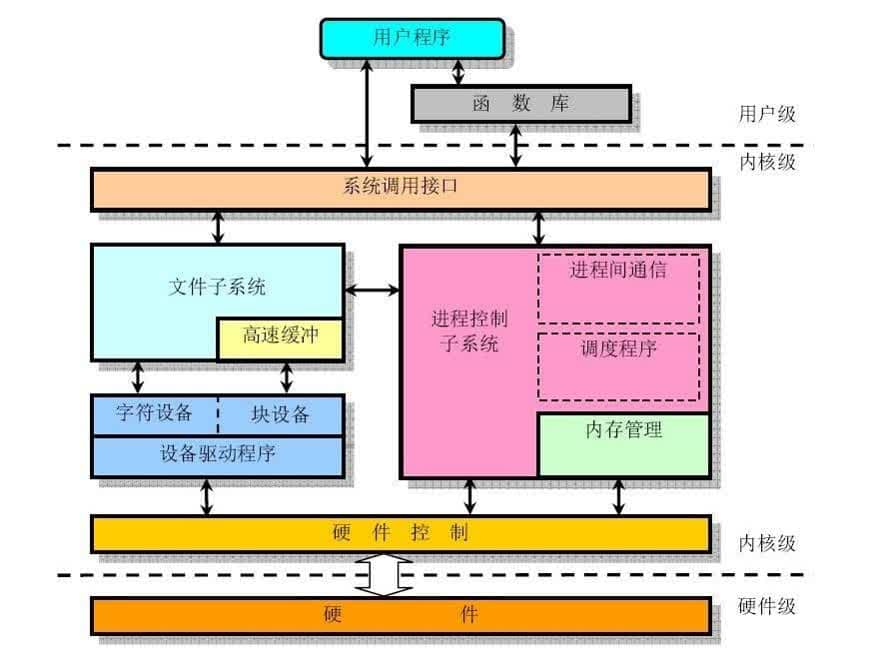

# 基础概念

### 什么是操作系统？

1. **操作系统（Operating System，简称 OS）是管理计算机硬件与软件资源的程序，是计算机的基石。**
2. **操作系统本质上是一个运行在计算机上的软件程序 ，用于管理计算机硬件和软件资源。** 举例：运行在你电脑上的所有应用程序都通过操作系统来调用系统内存以及磁盘等等硬件。
3. **操作系统存在屏蔽了硬件层的复杂性。** 操作系统就像是硬件使用的负责人，统筹着各种相关事项。
4. **操作系统的内核（Kernel）是操作系统的核心部分，它负责系统的内存管理，硬件设备的管理，文件系统的管理以及应用程序的管理**。

### 什么是操作系统内核？

**内核**（英语：Kernel，又称核心）在计算机科学中是一个用来管理软件发出的数据 I/O（输入与输出）要求的电脑程序，将这些要求转译为数据处理的指令并交由中央处理器（CPU）及电脑中其他电子组件进行处理，是现代操作系统中最基本的部分。它是为众多应用程序提供对计算机硬件的安全访问的一部分软件，这种访问是有限的，并由内核决定一个程序在什么时候对某部分硬件操作多长时间。 **直接对硬件操作是非常复杂的。所以内核通常提供一种硬件抽象的方法，来完成这些操作。有了这个，通过进程间通信机制及系统调用，应用进程可间接控制所需的硬件资源（特别是处理器及 IO 设备）。**

简单概括

1. **操作系统的内核（Kernel）是操作系统的核心部分，它负责系统的内存管理，硬件设备的管理，文件系统的管理以及应用程序的管理。**
2. **操作系统的内核是连接应用程序和硬件的桥梁，决定着操作系统的性能和稳定性。**

### CPU vs Kernel

1. 操作系统的内核（Kernel）属于操作系统层面，而 CPU 属于硬件。
2. CPU 主要提供运算，处理各种指令的能力。内核（Kernel）主要负责系统管理比如内存管理，它屏蔽了对硬件的操作。

### 系统调用

进程在系统上的运行分为两个级别：

1. **用户态(user mode)** : 用户态运行的进程或可以直接读取用户程序的数据。
2. **系统态(kernel mode)**: 可以简单的理解系统态运行的进程或程序几乎可以访问计算机的任何资源，不受限制。

在我们运行的用户程序中，凡是与系统态级别的资源有关的操作（如文件管理、进程控制、内存管理等)，都必须通过**系统调用**方式向操作系统提出服务请求，并由操作系统代为完成。

系统调用按**功能**可以分为几类：

**设备管理** ：完成设备的请求或释放，以及设备启动等功能。

**文件管理** ：完成文件的读、写、创建及删除等功能。

**进程控制** ：完成进程的创建、撤销、阻塞及唤醒等功能。

**进程通信** ：完成进程之间的消息传递或信号传递等功能。

**内存管理** ：完成内存的分配、回收以及获取作业占用内存区大小及地址等功能。

# Linux文件系统

Linux 系统中有一个重要的概念：**一切都是文件**。在 Linux 操作系统中，所有被操作系统管理的资源，例如网络接口卡、磁盘驱动器、打印机、输入输出设备、普通文件或是目录都被看作是一个文件。

### inode

**inode是存储文件元信息的区域，用来维护某个文件被分成几块、每一块在的地址、文件拥有者，创建时间，权限，大小等信息**。

硬盘的最小存储单位是扇区(Sector)，块(block)由多个扇区组成。文件数据存储在块中。块的最常见的大小是 4kb，约为 8 个连续的扇区组成（每个扇区存储 512 字节）。一个文件可能会占用多个 block，但是一个块只能存放一个文件。

文件存储在了块(block)中，但是我们还需要一个空间来存储文件的 **元信息 metadata** ：如某个文件被分成几块、每一块在的地址、文件拥有者，创建时间，权限，大小等。这种 **存储文件元信息的区域就叫 inode**，译为索引节点：**i（index）+node**。 每个文件都有一个 inode，存储文件的元信息。

### 文件类型

Linux 支持很多文件类型，其中非常重要的文件类型有: **普通文件**，**目录文件**，**链接文件**，**设备文件**，**管道文件**，**Socket 套接字文件**等。

### 常用命令

#### 目录操作命令

- **`mkdir 目录名称`：** 增加目录。
- **`ls/ll`**（ll 是 ls -l 的别名，ll 命令可以看到该目录下的所有目录和文件的详细信息）：查看目录信息。
- **`find 目录 参数`：** 寻找目录（查）。
- **`mv 目录名称 新目录名称`：** 修改目录的名称（改）。
- **`mv 目录名称 目录的新位置`：** 移动目录的位置---剪切（改）。
- **`cp -r 目录名称 目录拷贝的目标位置`：** 拷贝目录（改），-r 代表递归拷贝 。
- **`rm [-rf] 目录` :** 删除目录（删）。

#### 文件操作命令

- **`touch 文件名称`:** 文件的创建（增）。
- **`cat/more/less/tail 文件名称`** ：文件的查看（查） 。
- **`vim 文件`：** 修改文件的内容（改）。
- **`rm -rf 文件`：** 删除文件（删）。

#### 其他常用命令

- **`pwd`：** 显示当前所在位置
- `sudo + 其他命令`：以系统管理者的身份执行指令。
- ==**`grep 要搜索的字符串 要搜索的文件 --color`：** 搜索命令，--color 代表高亮显示。==
- **`ps -ef`/`ps -aux`：** 这两个命令都是查看当前系统正在运行进程，两者的区别是展示格式不同。
- **`kill -9 进程的pid`：** 杀死进程
- `netstat -an ` 查看当前系统的端口使用