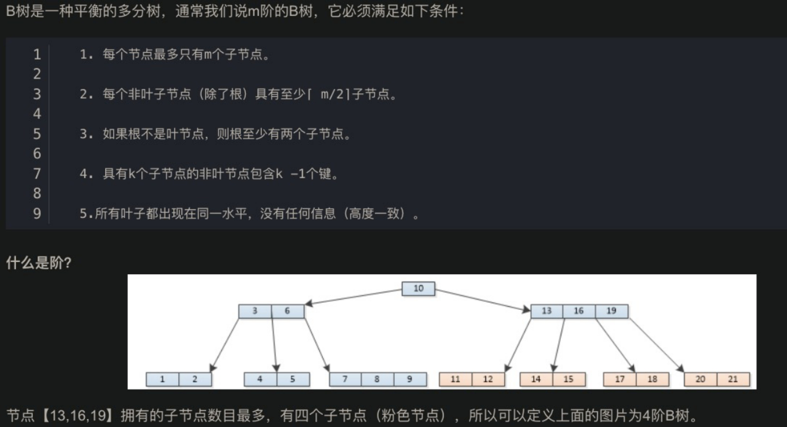
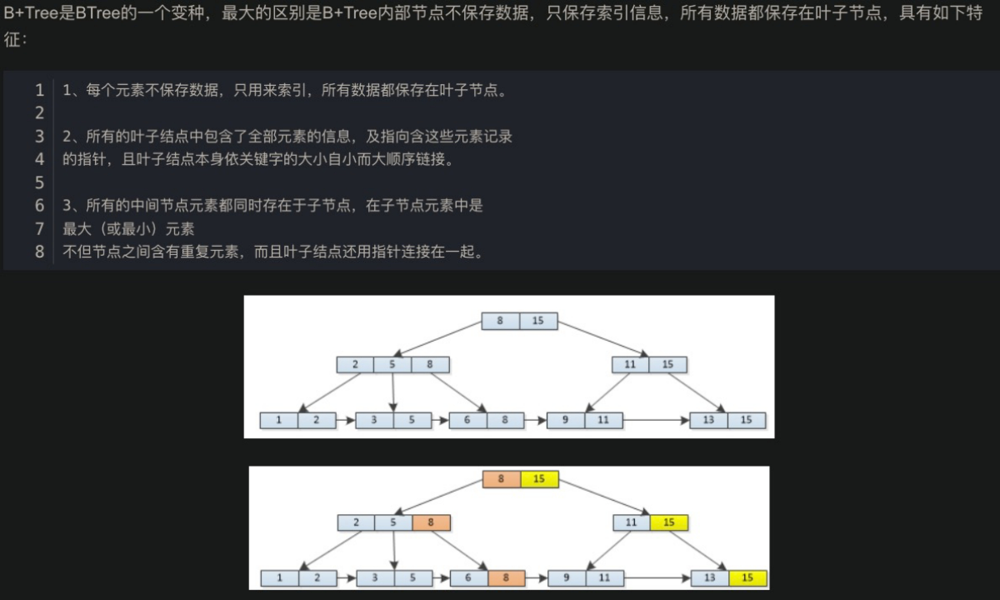
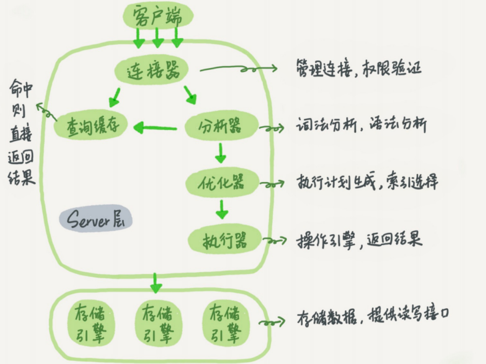
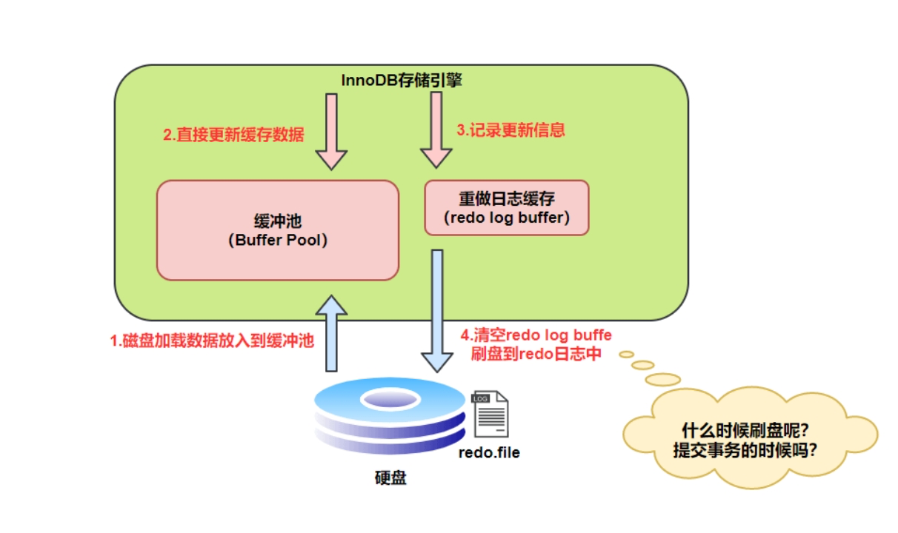
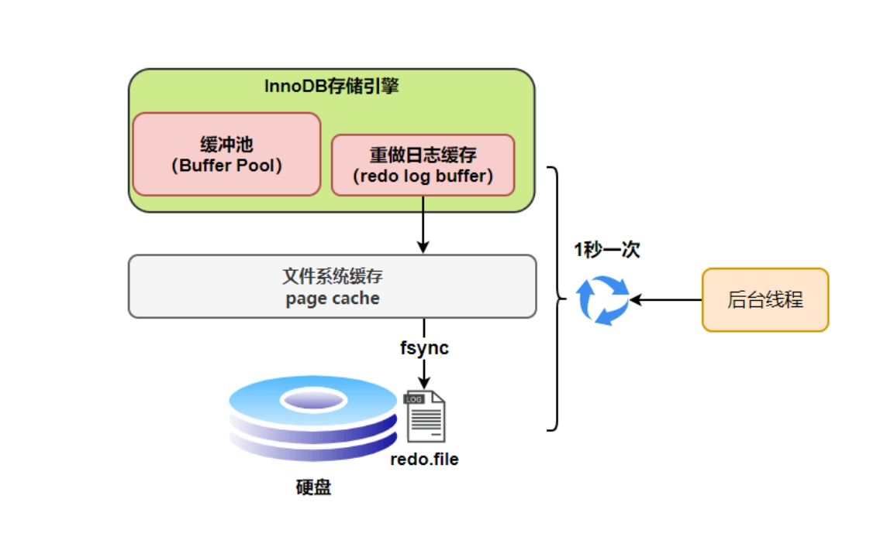
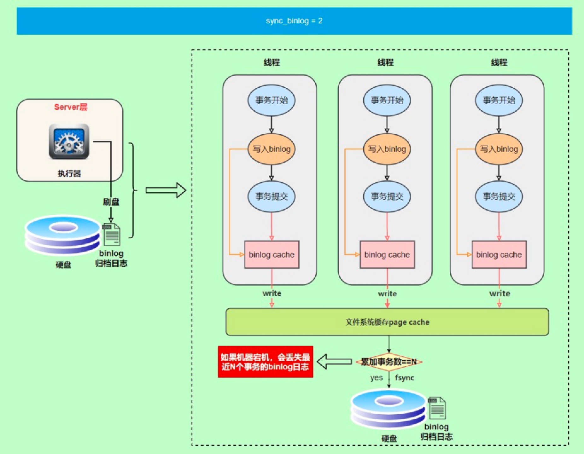

# 基础

## MySQL和MyISAM区别

1. InnoDB 支持**行级别的锁粒度**，MyISAM 不支持，只支持表级别的锁粒度。
2. MyISAM 不提供**事务支持**。InnoDB 提供事务支持，实现了 SQL 标准定义了四个隔离级别。
3. MyISAM 不支持**外键**，而 InnoDB 支持。
4. MyISAM 不支持 **MVCC**，而 InnoDB 支持。
5. 虽然 MyISAM 引擎和 InnoDB 引擎都是使用 B+Tree 作为索引结构，但是两者的实现方式不太一样，InnoDB 引擎中，其数据文件本身就是索引文件。相比 MyISAM，索引文件和数据文件是分离的。
6. MyISAM 不支持数据库**异常崩溃后的安全恢复**，而 InnoDB 支持。
7. InnoDB 的性能比 MyISAM 更强大。

## 【重要】什么是事务？事务的特性？

**一言蔽之，事务是逻辑上的一组操作，要么执行，要么都不执行。特性：ACID原子性（Atomicity）一致性（Consistency）隔离性（Isolation）持久性（Durability）原子性：由undo log保证，隔离性由锁和MVCC保证、持久性由redo log和bin log保证。**
**一致性由AID共同保证。**

- 原子性（Atomicity）： 事务是最小的执行单位，不允许分割。事务的原子性确保动作要么全部完成，要么完全不起作用；
- 隔离性（Isolation）： 并发访问数据库时，一个用户的事务不被其他事务所干扰，各并发事务之间数据库是独立的；
- 持久性（Durability）： 一个事务被提交之后。它对数据库中数据的改变是持久的，即使数据库发生故障也不应该对其有任何影响。
- 一致性（Consistency）： 执行事务前后，数据保持一致，多个事务对同一个数据读取的结果是相同的；

P.S.

SQL程序语言有四种类型，对数据库的基本操作都属于这四类，它们分别为；数据定义语言(DDL)、数据查询语言（DQL）、数据操纵语言（DML）、数据控制语言（DCL）

## 索引

### 类型总结

**数据结构纬度**

- BTree索引：MySQL中默认和最常用的索引类型。只有叶子节点存储value，非叶子节点只存储key和指针。
- Hash索引：键值对的形式
- 全文索引：一般不用，对文本内容进行分词，进行搜索，目前只有CHAR、VARCHAR、TEXT
- RTree索引：一般不用，仅支持geometry数据类型，优势在范围查找，效率较低，通常用搜索引擎如ElasticSearch代替
- 全文索引

**底层存储纬度**

- 聚簇索引：**索引结构和数据一起存放**
- 非聚簇索引：反之

**应用纬度**

主键索引、普通索引、联合索引（多列值组成一个索引）、**覆盖索引、全文索引、唯一索引（不能出现重复数据，可以为null，一张表可以多个唯一索引）**

### 最左匹配原则

使用联合索引时，根据索引字段中的顺序，从左到右依次匹配，遇到范围查询> < 才会停止匹配。<=, >=, between, like不会停止

### 索引下推

在非聚簇索引查找时，先对索引中包含的字段进行判断，减少回表次数。

### 自增主键一定连续吗？

1. 自增初始值和自增步长设置不为 1
2. 唯一键冲突
3. 事务回滚
4. 批量插入（如 insert...select 语句）

### 自增主键的好处？

1. 自增型主键有利于插入性能的提高，因为按索引列排序，插入在中间可能会需要调整二叉树，还可能导致页分裂。
2. 自增型主键设计(int,bigint)可以降低二级索引的空间，提升二级索引的内存命中率（占用空间小，一个页面更多索引）
3. 有利于查询性能提高，对页分裂，查询慢了，多一次磁盘IO

### 【重要】索引失效的场景

1. 查询条件包含or，可能导致失效
2. like通配符可能导致，如以%开头
3. 隐式类型转换，如userId为字符串，传int进去，类型不匹配会隐式转换成浮点数比较。
4. 查询条件不满足联合索引的最左匹配原则，如（idx, userId, name）我们查name是无效的
5. 索引字段上使用>、<可能导致失效
6. 对索引列进行运算（如+、-、*）

## B树、B+树介绍





## B树和B+树的区别

1. BTree节点上不仅存储key还存储着数据，而B+Tree只有叶子上存储数据，内部节点只存储着key。
2. B+Tree叶子节点上，还有连接左右叶子节点的指针，因此支持顺序查找。
3. BTree在检索过程可能不到叶子节点就结束了，因为节点上还存储着数据。但B+Tree的检索效率就比较稳定，需要查找到叶子节点。

## SQL查询语句如何执行？



1. 首先，客户端向数据库发送连接请求，需要ip、用户名、密码。建立连接成功后，能够查看自己的权限等（连接器所做的）【连接的过程复杂，因此建议用长连接，但是长连接会导致内存占用很大，因此推荐1.定期断开长连接，重新连接2.mysql_reset_connection重新初始化连接资源。这个过程不需要重连和重新做权限验证， 但是会将连接恢复到刚刚创建完时的状态。】。
2. 而后进行查询，会先查询缓存，如果存在与缓存则能直接返回（MySQL8.0 后移除这部分功能，why？不实用，因为只要一条数据的更新，则会使这一部分的缓存全部无效，只适用不经常更新的表）
3. 进入分析器，进行“词法分析”，验证语句是否正确。
4. 进入优化器，会采用更优的策略进行执行。
5. 执行，会先验证是否有对表进行相应操作的权限。有的话执行，将结果存在结果集，返回。

## SQL更新语句如何执行？

更新和查询一样，也会走一遍上面流程一遍（如上图）

1. 首先执行器会通过引擎搜索得到待更新数据所在的数据页，如果在内存中，则直接返回数据行，如果不在内存中，则会从磁盘中读入内存，然后返回。
2. 执行器得到数据页，更新数据，得到新的一行数据，调入引擎接口写入新数据。
3. 引擎将新数据更新到内存，同时将更新操作记录到redo log中，此时redo log处于prepare状态，然后告知执行器执行完成，可以随时提交事务。
4. 执行器生成这个操作的bin log，把bin log写入磁盘。
5. 执行器调用引擎的提交事务接口，引擎把刚刚写入的redo log改成提交（commit）状态，更新完成。

**这就是redo log[【两阶段提交】](https://javaguide.cn/database/mysql/mysql-logs.html)如果先写redo log后写bin log，数据库崩溃能够恢复数据，但是备份的时候少了；如果先写bin log后写redo log，恢复数据的时候少了，备份的时候多了。**

### redo log

**redo log它是物理日志**，记录内容是“**在某个数据页上做了什么修改**”，属于 InnoDB 存储引擎。它让MySQL拥有了崩溃恢复能力。更新的数据的时候，就直接在 Buffer Pool 里更新。然后会把“在某个数据页上做了什么修改”记录到重做日志缓存（redo log buffer）里，接着刷盘到 redo log 文件里。



**redo log刷盘支持三种策略**

0 ：设置为 0 的时候，表示每次事务提交时不进行刷盘操作

1 ：设置为 1 的时候，表示每次事务提交时都将进行刷盘操作（默认值）

2 ：设置为 2 的时候，表示每次事务提交时都只把 redo log buffer 内容写入 page cache

InnoDB 存储引擎有一个后台线程，每隔1 秒，就会把 redo log buffer 中的内容写到文件系统缓存（page cache），然后调用 fsync 刷盘。也就是说，一个没有提交事务的 redo log 记录，也可能会刷盘。（prepare）

 

**日志文件组**

write pos 是当前记录的位置，一边写一边后移

checkpoint 是当前要擦除的位置，也是往后推移

### binlog

binlog 是逻辑日志，记录内容是语句的原始逻辑，类似于“给 ID=2 这一行的 c 字段加 1”，属于MySQL Server 层。MySQL数据库的数据备份、主备、主主、主从都离不开binlog，需要依靠binlog来同步数据，保证数据一致性。

**binlog 日志有三种格式**

Statement：记录的内容是SQL语句原文

Row：记录的内容不再是简单的SQL语句了，还包含操作的具体数据（比如调用update_time=now() 时，采用statement会导致与原库不一致）row格式记录的内容看不到详细信息，要通过mysqlbinlog工具解析出来。

Mixed：MySQL会判断这条SQL语句是否可能引起数据不一致，如果是，就用row格式，否则就用statement格式。

**刷盘时机**

为了安全起见，可以设置为1，表示每次提交事务都会执行fsync，就如同 redo log 日志刷盘流程 一样。最后还有一种折中方式，可以设置为N(N>1)，表示每次提交事务都write，但累积N个事务后才fsync。

 

### 两种日志不同

两种日志有以下三点不同。

1. redo log是InnoDB引擎特有的；binlog是MySQL的Server层实现的，所有引擎都可以使用。 
2. redo log是**物理日志，记录的是“在某个数据页上做了什么修改”**；binlog是**逻辑日志，记录的是这个语句的原始逻辑，比如“给ID=2这一行的c字段加1 ”。** 
3. redo log是循环写的，空间固定会用完；binlog是可以追加写入的。“追加写”是指binlog文件 写到一定大小后会切换到下一个，并不会覆盖以前的日志。

## undo log

主要有两个作用：

1. **当事务回滚时将数据恢复到修改前的样子。**
2. **MVCC，当读取记录时若该记录被其他事务占用或当前版本对该事务不可见，就通过undo log读取之前的版本数据，实现非锁定读。**

**可以分为两种`insert undo log`和`update undo log`**

- `insert undo log`：insert操作产生的undo log，在事务提交后直接删除。
- `update undo log`：**update或delete操作产生的undo log**，可能需要提供MVCC机制，不能在事务提交后就删除，提交时放入undo log链表，等待`purge线程`删除。

### 数据可见性算法

**创建一个新事务后，执行每个select语句前，都会创建一个快照，保存当前数据库系统中正处于活跃（没有commit）的事务的ID。**（就是系统中不应该被本事务看到的其他事务的ID列表）<u>当这个事务要读取某个记录行的时候，InnoDB会将该记录行的`DB_TRX_ID`与`Read View`中的一些变量和`当前事务ID`进行比较，判断是否满足可见性条件。</u>

## 慢查询是什么

**将超过指定时间的SQL语句查询称为慢查询。**

有哪些情况会发生，解决办法？

- SQL没加索引，解决：加索引
- 索引失效（上面索引里有写）
- 大表情况下，出现I/O吞吐量或者CPU瓶颈，解决：采取分库或者分表；读写分离。

## MySQL锁

### 行级锁和表级锁

行级锁：针对索引字段加的锁 ，只针对当前操作的行记录进行加锁。加锁粒度最小，并发度高，但加锁的开销也最大，加锁慢，会出现死锁。

表级锁：针对非索引字段加的锁，对当前操作的整张表加锁。实现简单，资源消耗也比较少，加锁快，不会出现死锁。

### 几种行级锁

**1.记录锁（record lock）2.间隙锁（gap lock）3.临键锁（next-key lock）**

在 InnoDB 默认的**隔离级别 REPEATABLE-READ 下，行锁默认使用的是 Next-Key Lock**。但是，如果操作的索引是唯一索引或主键，InnoDB 会对 Next-Key Lock 进行优化，**将其降级为 Record Lock**，即仅锁住索引本身，而不是范围。

### 共享锁和排他锁

不论是表级锁还是行级锁，都存在共享锁（Share Lock，S 锁）和排他锁（Exclusive Lock，X 锁）这两类。

- 共享锁（S 锁） ：又称读锁，事务在读取记录的时候获取共享锁，允许多个事务同时获取（锁兼容）
- 排他锁（X 锁） ：又称写锁/独占锁，事务在修改记录的时候获取排他锁，不允许多个事务同时获取。如果一个记录已经被加了排他锁，那其他事务不能再对这条事务加任何类型的锁（锁不兼容）。

**注意：由于 MVCC 的存在，对于一般的 SELECT 语句，InnoDB 不会加任何锁。不过， 你可以通过以下语句显式加共享锁或排他锁。**

```sql
SELECT ... LOCK IN SHARE MODE;#共享锁
SELECT ... FOR UPDATE;#排他锁
```

### 意向锁

快速判断是否可以对某个表使用表锁。（如果需要用到表锁的话，如何判断表中的记录没有行锁呢，一行一行遍历肯定是不行）意向锁是表级锁，共有两种：

- 意向共享锁（Intention Shared Lock，IS 锁）：事务有意向对表中的某些记录加共享锁（S 锁），加共享锁前必须先取得该表的 IS 锁.
- 意向排他锁（Intention Exclusive Lock，IX 锁）：事务有意向对表中的某些记录加排他锁（X 锁），加排他锁之前必须先取得该表的 IX 锁。

意向锁是有数据引擎自己维护的，用户无法手动操作意向锁，在为数据行加共享/排他锁之前，InooDB 会先获取该数据行所在在数据表的对应意向锁。

### 当前读和快照读

快照读的情况下，如果读取的记录正在执行 UPDATE/DELETE 操作，读取操作不会因此去等待记录上 X 锁的释放，而是会去读取行的一个快照。
只有在事务隔离级别 RC(读取已提交) 和 RR（可重读）下，InnoDB 才会使用一致性非锁定读：在 RC 级别下，对于快照数据，一致性非锁定读总是读取被锁定行的最新一份快照数据。在 RR 级别下，对于快照数据，一致性非锁定读总是读取本事务开始时的行数据版本。快照读比较适合对于数据一致性要求不是特别高且追求极致性能的业务场景。
当前读 （一致性锁定读）就是给行记录加 X 锁或 S 锁。

### 数据可见性算法

在 InnoDB 存储引擎中，创建一个新事务后，执行每个 select 语句前，都会创建一个快照（Read View），快照中保存了当前数据库系统中正处于活跃（没有 commit）的事务的 ID 号。其实简单的说保存的是系统中当前不应该被本事务看到的其他事务 ID 列表（即 m_ids）。当用户在这个事务中要读取某个记录行的时候，InnoDB 会将该记录行的 DB_TRX_ID 与 Read View 中的一些变量及当前事务 ID 进行比较，判断是否满足可见性条件

# 并发情况

### MySQL大量并发写入，如何保证数据完整性？

1. 涉及高并发系统，必须涉及事务，所以数据库引擎选择InnoDB。
2. 数据库分为主数据库和从数据库，主数据库负责写入数据，集群数据库负责读取。
3. 