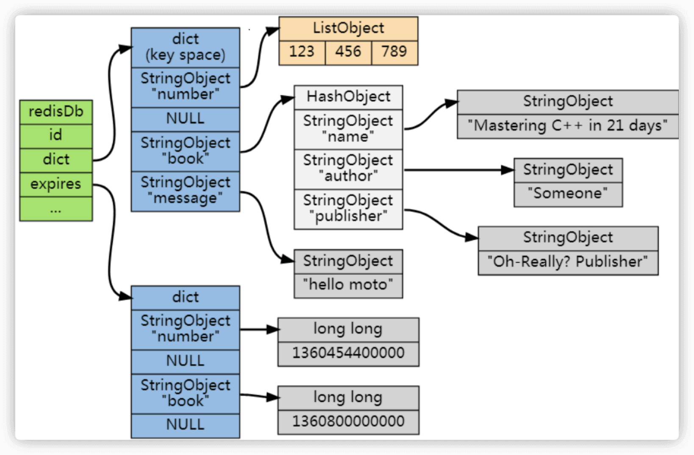
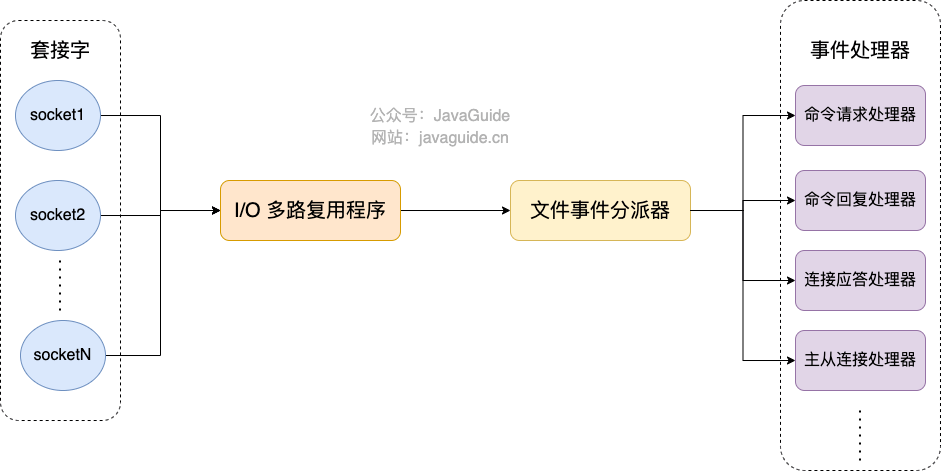
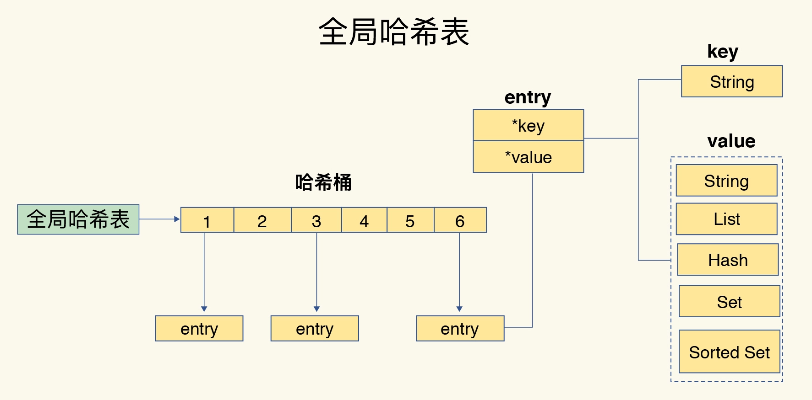
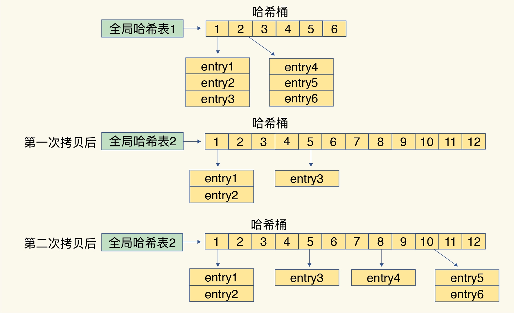
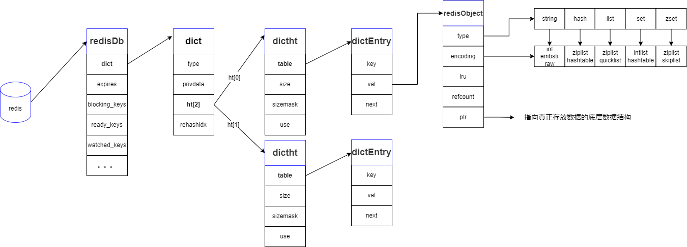
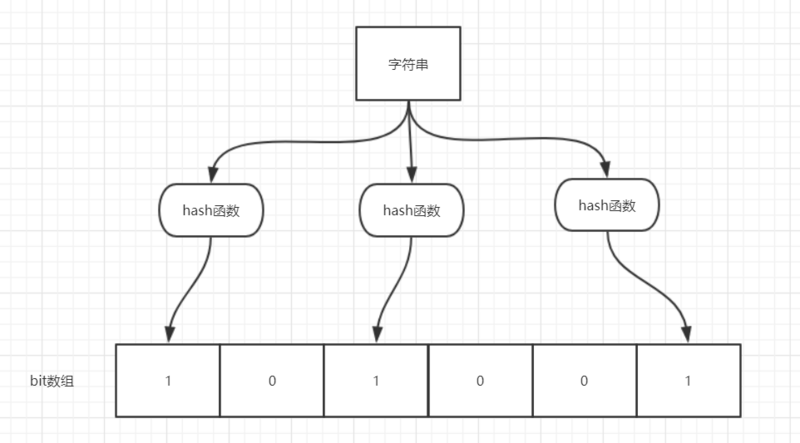

[TOC]
## Redis基础
### 1. 什么是Redis？
Redis是一个基于C语言开发的开源数据库（BSD许可），与传统数据库不同的是Redis的数据是存在于内存中，读写速度非常快，广泛应用于缓存方向。并且，Redis存储的是KV键值对数据。
为了满足不同的业务场景，它内置了多种数据类型实现（如String、Hash、Sorted Set）。~~并且Redis还支持事务、持久化、Lua脚本、多种开箱即用的集群方案（Redis Sentinel、Redis Cluster）~~【划掉意思不要讲这么多】

### 2. Redis为什么这么快？

1. Redis基于内存，内存访问速度是磁盘的上千倍
2. Redis基于Reactor模式设计开发了一套高效的事件处理模型，主要是单线程事件循环和I/O多路服用
3. Redis内置了多种优化后的数据结构实现，性能高。


P.S.
Reactor 模式也叫做反应器设计模式，是一种为处理服务请求并发提交到一个或者多个服务处理器的事件设计模式。当请求抵达后，通过服务处理器将这些请求采用多路分离的方式分发给相应的请求处理器。Reactor 模式主要由 Reactor 和处理器 Handler 这两个核心部分组成，如下图所示，它俩负责的事情如下：
Reactor：负责监听和分发事件，事件类型包含连接事件、读写事件；
Handler：负责处理事件，如 read -> 业务逻辑 （decode + compute + encode）-> send
### 3. Redis和Memcached的区别？
**共同点：**
1. 都是基于内存的数据库，一般都用来当做缓存使用。
2. 都有过期策略。
3. 两者的性能都非常高。

**区别：**
1. Redis 支持更丰富的数据类型（支持更复杂的应用场景）。Redis 不仅仅支持简单的 k/v 类型的数据，同时还提供 list，set，zset，hash 等数据结构的存储。
2. Memcached 只支持最简单的 k/v 数据类型。Redis 支持数据的持久化，可以将内存中的数据保持在磁盘中，重启的时候可以再次加载进行使用,而 Memcached 把数据全部存在内存之中。
3. Redis 有灾难恢复机制。 因为可以把缓存中的数据持久化到磁盘上。
4. Redis 在服务器内存使用完之后，可以将不用的数据放到磁盘上。但是，Memcached 在服务器内存使用完之后，就会直接报异常。
5. Memcached 没有原生的集群模式，需要依靠客户端来实现往集群中分片写入数据；但是 Redis 目前是原生支持 cluster 模式的。
6. Memcached 是多线程，非阻塞 IO 复用的网络模型；Redis 使用单线程的多路 IO 复用模型。 （Redis 6.0 引入了多线程 IO ）
7. Redis 支持发布订阅模型、Lua 脚本、事务等功能，而 Memcached 不支持。并且，Redis 支持更多的编程语言。
Memcached 过期数据的删除策略只用了惰性删除，而 Redis 同时使用了惰性删除与定期删除。

***不过由于把数据都存在内存中，不能无节制地存下去，因此需要考虑缓存过期&&缓存淘汰***

### 4. 缓存过期&&缓存淘汰

定期随机删除一部分，但是一直有一部分没删除 -> 遇到查询请求，被发现过期直接删除（惰性删除），但还是有一部分一直没删 -> 内存淘汰策略（已用内存超过maxmemory，触发主动清理策略）

不处理

* noeviction：返回错误，不会删除任何键值

针对所有的key处理

* allkeys-lru：使用LRU算法删除最近最少使用的键值
* allkeys-lfu：从所有键中删除使用频率最少的键
* allkeys-random：从所有key随机删除

针对设置了过期时间的key做处理

* volatile-random：从设置了过期时间的键的集合中随机删除
* volatile-ttl：从设置了过期时间的键中删除剩余时间最短的键
* volatile-lfu：从配置了过期时间的键中删除使用频率最少的键
* **volatile-lru**：使用LRU算法从设置了过期时间的键集合中删除最近最少使用的键值

==**大部分情况采用LRU就可以**，====当存在大量热点缓存数据时，LFU可能好一点。==

#### 4.1 如何判断数据是否过期呢？

Redis 通过一个叫做过期字典（可以看作是 hash 表）来保存数据过期的时间。过期字典的键指向 Redis 数据库中的某个 key(键)，过期字典的值是一个 long long 类型的整数，这个整数保存了 key 所指向的数据库键的过期时间（毫秒精度的 UNIX 时间戳）。



***既然是数据库，肯定需要考虑持久化，那么就到了Redis持久化机制了***

### 5.Redis持久化机制
Redis有两种持久化方式，一种是快照（snapshotting, RDB），另一种是只追加文件（append-only file, AOF）
#### 5.1 RDB持久化
Redis 可以通过创建快照来获得存储在内存里面的数据在某个时间点上的副本。Redis 创建快照之后，可以对快照进行备份，可以将快照复制到其他服务器从而创建具有相同数据的服务器副本（Redis 主从结构，主要用来提高 Redis 性能），还可以将快照留在原地以便重启服务器的时候使用。【默认持久化方式】
#### 5.2 创建快照会阻塞主线程吗？

有两个命令生成RDB快照：
save: 同步保存操作，会阻塞 Redis 主线程；
bgsave: fork 出一个子进程，子进程执行，不会阻塞 Redis 主线程，默认选项。

#### 5.3 AOF持久化

每执行一条会更改Redis中数据的命令，会将该命令写入到内存缓存server.aof_buf中，根据appendfsync配置决定其何时同步到磁盘AOF文件中。【实时性更好，成为主流】一般考虑appendfsync everysec每秒钟同步一次。
```
appendfsync always    #每次有数据修改发生时都会写入AOF文件,这样会严重降低Redis的速度
appendfsync everysec  #每秒钟同步一次，显式地将多个写命令同步到硬盘
appendfsync no        #让操作系统决定何时进行同步
```

* 实现：执行完命令后记录日志。

* why？1.避免额外检查开销，不用对命令进行语法检查 2.命令执行完后再记录，不会阻塞命令执行。

* 风险：1.执行完命令就宕机，对应修改丢失 2.阻塞后续命令的执行（记录日志在主线程执行）

* 对比：MySQL在执行命令之前记录日志，方便故障恢复。
#### 5.4 AOF重写机制

当AOF变得太大，Redis就会在后台重写产生新的AOF文件，与原有AOF文件所保存的数据库状态一致，体积更小。
P.S. AOF重写是一个有歧义的名字，该功能是通过读取数据库中的键值对来实现的，程序无须对现有AOF文件进行任何读入、分析或者写入操作。
在执行<u> BGREWRITEAOF </u>命令时，Redis 服务器会维护一个 AOF 重写缓冲区，该缓冲区会在子进程创建新 AOF 文件期间，记录服务器执行的所有写命令。当子进程完成创建新 AOF 文件的工作之后，服务器会将重写缓冲区中的所有内容追加到新 AOF 文件的末尾，使得新的 AOF 文件保存的数据库状态与现有的数据库状态一致。最后，服务器用新的 AOF 文件替换旧的 AOF 文件，以此来完成 AOF 文件重写操作。

#### 5.5 两种持久化方式的优缺点？

RDB比AOF优秀的地方：
1. RDB文件存储的是经过压缩的二进制数据，文件更小，适合做数据备份、灾难恢复。AOF存储的是每一次写命令，通常比RDB文件大很多。
2. RDB文件恢复数据，直接解析还原数据即可，速度很快。AOF则需要依次执行每个写命令，速度很慢。

AOF比RDB优秀的地方：
1. AOF数据安全性更高，能够实现实时或秒级持久化数据。生成RDB文件的过程比较繁重，AOF只是追加命令到AOF文件中，操作轻量。
2. Redis以二进制格式保存，演进过程有多个版本的RDB，存在老版本不兼容新版本RDB格式的问题。
3. AOF文件易于理解和解析，可以直接操作AOF文件来解决一些问题。如：如果执行FLUSHALL命令意外地刷新了所有内容后，只要 AOF 文件没有被重写，删除最新命令并重启即可恢复之前的状态。
### 6. Redis单线程模型了解吗？

Redis 是单线程的。

    Redis 基于 Reactor 模式设计开发了一套高效的事件处理模型，这套事件处理模型对应的是 Redis 中的文件事件处理器（file event handler）。由于文件事件处理器（file event handler）是单线程方式运行的，所以我们一般都说 Redis 是单线程模型。
Redis 通过 **<u>IO多路复用程序</u>** 来监听来自客户端的大量连接。
好处：I/O 多路复用技术的使用让 Redis 不需要额外创建多余的线程来监听客户端的大量连接，降低了资源的消耗
Redis 利用队列技术将并发访问变为串行访问，消除了传统数据库串行控制的开销


### 7. Redis存储数据的形式

前面已经说了，Redis是已键值对的形式存储数据。它有五种基本数据类型，String（字符串）、List（列表）、Hash（哈希）、Set（集合）和 ZSet（有序集合）这些数据类型的底层，是由8种数据结构实现的，分别为简单动态字符串（SDS）、LinkedList（双向链表）、Hash Table（哈希表）、SkipList（跳跃表）、Intset（整数集合）、ZipList（压缩列表）、QuickList（快速列表）。

| **String** | **List**                     | **Hash**            | **Set**         | **Zset**          |
| ---------- | ---------------------------- | ------------------- | --------------- | ----------------- |
| SDS        | LinkedList/ZipList/QuickList | Hash Table、ZipList | ZipList、Intset | ZipList、SkipList |

==**Redis使用了一个哈希表来保存所有的键值对！key是String类型！value可以是很多类型（RedisObject）**==哈希表中每一个元素称为哈希桶。所以，哈希表是由多个哈希桶组成的，每个哈希桶中保存了键值对数据，哈希桶中的元素保存的并不是值本身，而是指向具体值的指针。这也就是说，不管值是 String，还是集合类型，哈希桶中的元素都是指向它们的指针。

如下图，哈希桶中的 entry 元素中保存了* key和* value指针，分别指向了实际的键和值，不管值是String还是集合，也可以通过*value指针被查找到。



#### 7.1 哈希冲突的解决

采用拉链式的链式哈希

#### 7.2 哈希冲突过多的解决方式

先说答案：采用渐进式rehash，就是增加现有哈希桶的数量。

**普通rehash：**使用了两个全局哈希表：哈希表 1 和哈希表 2。一开始刚插入数据时，默认使用哈希表 1，此时的哈希表 2 并没有被分配空间。随着数据逐步增多，Redis 开始执行 rehash，这个过程分为三步：

1. 给哈希表 2 分配更大的空间，例如是当前哈希表 1 大小的两倍；

2. 把哈希表 1 中的数据重新映射并拷贝到哈希表 2 中；
3. 释放哈希表 1 的空间。

显然，在第二步的时候涉及大量数据拷贝，一次性拷贝完会造成Redis线程阻塞。

**渐进式reash：**简单来说就是在第二步拷贝数据时，Redis 仍然正常处理客户端请求，每处理一个请求时，从哈希表 1 中的第一个索引位置开始，顺带着将这个索引位置上的所有 entries 拷贝到哈希表 2 中；等处理下一个请求时，再顺带拷贝哈希表 1 中的下一个索引位置的 entries，如下图所示。另一种情况，如果一直没有请求，会定时rehash，100ms一次迁移操作。



#### 7.3 总结



- **redisDb** ：redis的顶层数据库结构，内部定义了数据存储结构字典dict，过期时间、用于阻塞key以及事务相关的监听。
- **dict** ：用于存储redis中的k-v数据的字段结构。其中定义了两个hashtable和rehash下标值。
- **dictht** ： redis中真正的hash表，二维数组结构，内部定义了存储k-v的entry、数组长度、确定数据存放位置的模、数组内的数据量。
- **dictEntry** ：用于存储k-v数据的entry对象，内部封装了key、value字段，以及用于处理hash冲突的指针。
- **redisObject**：用于封装value数字的对象；其内部包含了value的命令类型、底层存储结构、回收策略、lru信息等

## Redis进阶

### 1. 缓存穿透

缓存穿透说简单点就是大量请求的 key 是不合理的，**根本不存在于缓存中，也不存在于数据库中** 。这就导致这些请求直接到了数据库上，根本没有经过缓存这一层，对数据库造成了巨大的压力，可能直接就被这么多请求弄宕机了。

**解决方法？**

最基本就是需要做好参数校验，一些不合法的参数请求直接抛出异常信息返回给客户端。

1. 缓存无效key

   如果缓存和数据库中都查不到某个key，就写到Redis中去并设置过期时间。可以解决key变化不频繁的情况。具体命令如下：`SET key value EX 10086`

   题外话，通常这样设计key`表名:列名:主键名:主键值`

2. 布隆过滤器

   非常神奇的一个数据结构，可以非常方便地判断一个给定数据是否存在于海量数据中。需要做的就是判断key是否合法。但是，布隆过滤器可能存在误判的情况，总结来说就是：**布隆过滤器说某个元素存在，小概率会误判。布隆过滤器说某个元素不在，那么这个元素一定不在。**

==**布隆过滤器原理**==

**当一个元素加入布隆过滤器中的时候，会进行如下操作：**

1. 使用布隆过滤器中的哈希函数对元素值进行计算，得到哈希值（有几个哈希函数得到几个哈希值）。
2. 根据得到的哈希值，在位数组中把对应下标的值置为 1。

**当我们需要判断一个元素是否存在于布隆过滤器的时候，会进行如下操作：**

1. 对给定元素再次进行相同的哈希计算；
2. 得到值之后判断位数组中的每个元素是否都为 1，如果值都为 1，那么说明这个值在布隆过滤器中，如果存在一个值不为 1，说明该元素不在布隆过滤器中。



### 2. 缓存击穿

缓存击穿中，请求的key是**热点数据**，该数据**存在于数据库中，但不存在于缓存中**（通常因为缓存中数据过期）。这就可能导致一瞬间大量的请求打到了数据库上，对数据库造成了巨大的压力。

**解决方法**

1. 热点数据永不过期或者过期时间比较长。
2. 对热点数据提前预热，将其存入缓存中，并设置合理的过期时间比如秒杀场景下的数据在秒杀结束前不过期。
3. 请求数据库写数据到缓存前，先获取互斥锁，保证只有一个请求会落到数据库上，减少数据库的压力。

### 3. 缓存雪崩

**缓存在同一时间大面积的失效**，导致大量的请求直接落到了数据库上，对数据库造成了巨大的压力。

**解决方法**

针对Redis服务不可用的情况：

1. 采用Redis集群，避免单机出现问题，整个缓存服务都无法使用。
2. 限流，避免同时处理大量请求。

针对热点缓存失效的情况：

1. 设置不同的失效时间，如随机设置缓存失效时间
2. 缓存永不失效（不推荐）
3. 设计二级缓存

### 4. 缓存雪崩和缓存击穿有什么区别？

缓存雪崩和缓存击穿比较像，但缓存雪崩导致的原因是缓存中的大量或者所有数据失效，缓存击穿导致的原因主要是某个热点数据不存在与缓存中（通常是因为缓存中的那份数据已经过期）。

### 5. 如何保证缓存和数据库的一致性？

先更新DB，后删除缓存。采用**旁路缓存模式**。如果更新数据库成功，删除缓存失败，两个解决方案：

1. 缓存失效时间变短（不推荐，治标不治本）
2. 增加cache更新重试机制（常用）
3. 如果 cache 服务当前不可用导致缓存删除失败的话，我们就隔一段时间进行重试，重试次数可以自己定。如果多次重试还是失败的话，我们可以把当前更新失败的 key 存入队列中，等缓存服务可用之后，再将缓存中对应的 key 删除即可。

## Redis五种基本数据结构详解

| **String** | **List**                     | **Hash**            | **Set**         | **Zset**          |
| ---------- | ---------------------------- | ------------------- | --------------- | ----------------- |
| SDS        | LinkedList/ZipList/QuickList | Hash Table、ZipList | ZipList、Intset | ZipList、SkipList |

### String

#### 介绍

String是一种二进制安全的数据结构，**可以用来存储任何数据结构**，比如字符串、整数、浮点数、图片（图片的 base64 编码或者解码或者图片的路径）、序列化后的对象。

Redis 的 SDS 不光可以保存文本数据还可以保存二进制数据，**并且获取字符串长度复杂度为 O(1)（C 字符串为 O(N)）**,除此之外，Redis 的 SDS API 是安全的，不会造成缓冲区溢出。

#### 应用场景

常规存储数据场景：缓存 session、token、图片地址、序列化后的对象(相比较于 Hash 存储更节省内存)。

需要计数的场景：用户单位时间的请求数（简单限流可以用到）、页面单位时间的访问数。

分布式锁：利用`SETNX key value`命令实现一个简易的分布式锁（通常不建议这样实现）

### List

就是链表数据结构的实现。

#### 应用场景

信息流展示：最新文章、最新动态。

消息队列：List数据结构可以用来做消息队列，但一般不建议。

### Hash

是一个String类型的field-value（键值对）的映射表，特别适合用于存储对象，后续操作的时候，可以直接修改这个对象中的某些字段。

应用场景：（适合存储对象数据）用户信息、商品信息、文章信息、购物车信息

### Set

无序集合，元素没有先后顺序但都唯一。

应用场景

需要存放的数据不能重复的场景：网站UV统计（数据量巨大还是用HyperLogLog更适合）、文章点赞、动态点赞等场景。

需要获取多个数据源交集、并集和差集的场景：共同好友(交集)、共同粉丝(交集)、共同关注(交集)、好友推荐（差集）、音乐推荐（差集） 、订阅号推荐（差集+交集） 等场景。

### Sorted Set

类似于Set，增加了一个权重参数score，使得集合中的元素能够按照按score进行有序排列，能够通过score的范围获取元素列表。

#### 应用场景

需要随机获取数据源中的元素根据某个权重进行排序的场景，如各种排行榜（微信步数排行榜）。

需要存储的数据有优先级或者重要程度的场景，比如优先级任务队列。

## 参考资料

1. https://javaguide.cn/database/redis/redis-questions-01.html#redis-%E5%9F%BA%E7%A1%80
2. https://blog.csdn.net/A_art_xiang/article/details/126742119