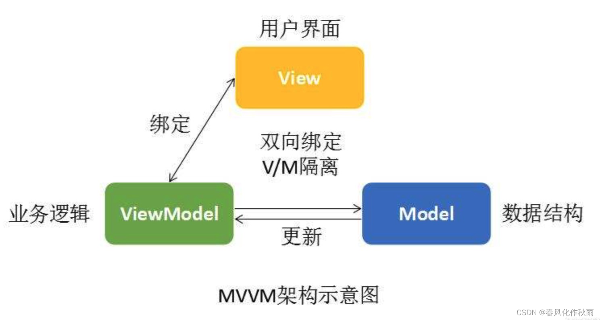
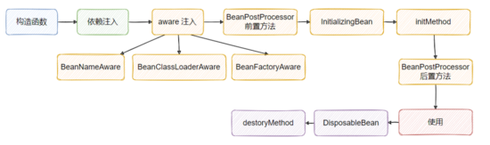

## Spring基础

### 什么是Spring框架？

一般说 Spring 框架指的都是 Spring Framework，它是很多模块的集合，使用这些模块可以很方便地协助我们进行开发，比如说 Spring 支持 IoC（Inversion of Control:控制反转） 和 AOP(Aspect-Oriented Programming:面向切面编程)、可以很方便地对数据库进行访问、可以很方便地集成第三方组件（电子邮件，任务，调度，缓存等等）、对单元测试支持比较好、支持 RESTful Java 应用程序的开发。

==Spring提供的核心功能主要是**IoC**和**AOP**重中之重==

### Spring、Spring MVC、Spring Boot之间的关系？

Spring包含多个功能模块，最重要的是Spring-Core模块（提供IoC依赖注入功能的支持），其他模块如Spring MVC的功能实现基本都需要依赖该模块。

Spring MVC 是 Spring 中的一个很重要的模块，主要赋予 Spring 快速构建 MVC 架构的 Web 程序的能力。MVC 是模型(Model)、视图(View)、控制器(Controller)的简写，其核心思想是通过将业务逻辑、数据、显示分离来组织代码。


使用Spring进行开发各种配置过于麻烦，于是Spring Boot诞生了！Spring 旨在简化 J2EE 企业应用程序开发。Spring Boot 旨在简化 Spring 开发（减少配置文件，开箱即用！）。

Spring Boot 只是简化了配置，如果你需要构建 MVC 架构的 Web 程序，你还是需要使用 Spring MVC 作为 MVC 框架，只是说 Spring Boot 帮你简化了 Spring MVC 的很多配置，真正做到开箱即用！

### 说说Spring MVC的了解

MVC 是模型(Model)、视图(View)、控制器(Controller)的简写，其是一种分层架构的设计思想，其核心是通过将业务逻辑、数据、显示分离来组织代码。早期整个web应用几乎都是用JSP页面组成，这种情况下JSP是Controller也是View，各种逻辑混在一起。Spring MVC将其分为这三种，客户端发起请求，由Controller进行接收，调用相应的Model层进行处理，Controller再根据请求处理的结果找到相应的View是图，渲染数据后响应给浏览器。

### 对MVVM的了解

MVVM，是Model-View-ViewModel的简写，是M-V-VM三部分组成。它核心思想，是关注model的变化，让MVVM框架利用自己的机制自动更新DOM，也就是所谓的数据-视图分离，数据不会影响视图。本质上就是MVC 的改进版，弱化了C的概念，ViewModel存在目的在于抽离Controller中展示的业务逻辑，而不是替代Controller，其它视图操作业务等还是应该放在Controller中实现。

一是将模型(Model)转化成视图(View)，即将后端传递的数据转化成所看到的页面，实现的方式是：数据绑定;

二是将视图(View)转化成模型(Model)，即将所看到的页面转化成后端的数据。实现的方式是：DOM事件监听，这两个方向都实现的，我们称之为数据的双向绑定。

场景：数据操作比较多的场景，需要大量操作DOM元素时，采用MVVM的开发方式，会更加便捷，让开发者更多的精力放在数据的变化上，解放繁琐的操作DOM元素。



### Spring用到了什么设计模式？

- **工厂设计模式** : Spring 使用工厂模式通过 `BeanFactory`、`ApplicationContext` 创建 bean 对象。
- **代理设计模式** : Spring AOP 功能的实现。
- **单例设计模式** : Spring 中的 Bean 默认都是单例的。
- **模板方法模式** : Spring 中 `jdbcTemplate`、`hibernateTemplate` 等以 Template 结尾的对数据库操作的类，它们就使用到了模板模式。
- **包装器设计模式** : 我们的项目需要连接多个数据库，而且不同的客户在每次访问中根据需要会去访问不同的数据库。这种模式让我们可以根据客户的需求能够动态切换不同的数据源。
- **观察者模式:** Spring 事件驱动模型就是观察者模式很经典的一个应用。
- **适配器模式** : Spring AOP 的增强或通知(Advice)使用到了适配器模式、spring MVC 中也是用到了适配器模式适配`Controller`。
- ···

## Spring IoC

### 对IoC的了解？

**IoC（Inversion of Control：控制反转）是一种设计思想，不是一个具体的技术实现**。IoC 的思想就是**将原本在程序中手动创建对象的控制权，交由 Spring 框架来管理**。不过， IoC 并非 Spring 特有，在其他语言中也有应用。

在 Spring 中， IoC 容器是 Spring 用来实现 IoC 的载体， IoC 容器实际上就是个 Map（key，value），Map 中存放的是各种对象。

### 什么是Spring Bean？

简单来说，Bean 代指的就是那些被 IoC 容器所管理的对象。

我们需要告诉 IoC 容器帮助我们管理哪些对象，这个是通过配置元数据来定义的。配置**元数据可以是 XML 文件、注解或者 Java 配置类**。

```xml
<!-- Constructor-arg with 'value' attribute -->
<bean id="..." class="...">
   <constructor-arg value="..."/>
</bean>
```

### 将一个类声明为 Bean 的注解有哪些?

- `@Component` ：通用的注解，可标注任意类为 `Spring` 组件。如果一个 Bean 不知道属于哪个层，可以使用`@Component` 注解标注。
- `@Repository` : 对应持久层即 Dao 层，主要用于数据库相关操作。
- `@Service` : 对应服务层，主要涉及一些复杂的逻辑，需要用到 Dao 层。
- `@Controller` : 对应 Spring MVC 控制层，主要用于接受用户请求并调用 `Service` 层返回数据给前端页面。

### @Component 和 @Bean 的区别是什么？

- `@Component` 注解作用于类，而`@Bean`注解作用于方法。
- `@Component`通常是通过类路径扫描来自动侦测以及自动装配到 Spring 容器中（我们可以使用 `@ComponentScan` 注解定义要扫描的路径从中找出标识了需要装配的类自动装配到 Spring 的 bean 容器中）。`@Bean` 注解通常是我们在标有该注解的方法中定义产生这个 bean,`@Bean`告诉了 Spring 这是某个类的实例，当我需要用它的时候还给我。
- `@Bean` 注解比 `@Component` 注解的自定义性更强，而且很多地方我们只能通过 `@Bean` 注解来注册 bean。比如当我们引用第三方库中的类需要装配到 `Spring`容器时，则只能通过 `@Bean`来实现。

###  注入 Bean 的注解有哪些？

Spring 内置的 `@Autowired` 以及 JDK 内置的 `@Resource` 和 `@Inject` 都可以用于注入 Bean。`@Autowired` 和`@Resource`使用的比较多一些。

### @Autowired 和 @Resource 的区别是什么？

先说结论：

- `@Autowired` 是 Spring 提供的注解，`@Resource` 是 JDK 提供的注解。
- `Autowired` 默认的注入方式为`byType`（根据类型进行匹配），`@Resource`默认注入方式为 `byName`（根据名称进行匹配）。
- 当一个接口存在多个实现类的情况下，`@Autowired` 和`@Resource`都需要通过名称才能正确匹配到对应的 Bean。`Autowired` 可以通过 `@Qualifier` 注解来显式指定名称，`@Resource`可以通过 `name` 属性来显式指定名称。

@Autowired属于Spring内置的注解，默认注入方式为`byType`，找不到就`byName`，可以通过`@Qualifier` 注解来显式指定名称。。举个例子：一个接口有多个实现类，此时用`byType`就找不到，这种情况下会变为`byName`。如`SmsService`有`smsServiceImpl1`和`smsServiceImpl2`两个实现类。

```java
// 报错，byName 和 byType 都无法匹配到 bean
@Autowired
private SmsService smsService;
// 正确注入 SmsServiceImpl1 对象对应的 bean
@Autowired
private SmsService smsServiceImpl1;
// 正确注入  SmsServiceImpl1 对象对应的 bean
// smsServiceImpl1 就是我们上面所说的名称
@Autowired
@Qualifier(value = "smsServiceImpl1")
private SmsService smsService;
```

@Resource属于JDK提供的注解，默认方式是`byName`，找不到才`byType`，它有两个重要且常用的属性`name`和`type`如果仅指定 `name` 属性则注入方式为`byName`，如果仅指定`type`属性则注入方式为`byType`，如果同时指定`name` 和`type`属性（不建议这么做）则注入方式为`byType`+`byName`。

```java
// 报错，byName 和 byType 都无法匹配到 bean
@Resource
private SmsService smsService;
// 正确注入 SmsServiceImpl1 对象对应的 bean
@Resource
private SmsService smsServiceImpl1;
// 正确注入 SmsServiceImpl1 对象对应的 bean（比较推荐这种方式）
@Resource(name = "smsServiceImpl1")
private SmsService smsService;
```

### Bean的作用域有哪些？

1. **singleton** : IoC 容器中只有唯一的 bean 实例。**Spring 中的 bean 默认都是单例的**，是对单例设计模式的应用。
2. **prototype** : 每次获取都会创建一个新的 bean 实例。也就是说，连续 `getBean()` 两次，得到的是不同的 Bean 实例。
3. **request** （仅 Web 应用可用）: 每一次 HTTP 请求都会产生一个新的 bean（请求 bean），该 bean 仅在当前 HTTP request 内有效。
4. **session** （仅 Web 应用可用） : 每一次来自新 session 的 HTTP 请求都会产生一个新的 bean（会话 bean），该 bean 仅在当前 HTTP session 内有效。
5. **application/global-session** （仅 Web 应用可用）： 每个 Web 应用在启动时创建一个 Bean（应用 Bean），该 bean 仅在当前应用启动时间内有效。
6. **websocket** （仅 Web 应用可用）：每一次 WebSocket 会话产生一个新的 bean。

**如何配置呢？**

```java
// xml的方式
<bean id="..." class="..." scope="singleton"></bean>
// 注解的方式
@Bean
@Scope(value = ConfigurableBeanFactory.SCOPE_PROTOTYPE)
public Person personPrototype() {
    return new Person();
}
```

### 单例Bean的线程安全问题？

多个线程操作同一个对象的时候存在资源竞争关系。不过大部分bean实际都是无状态的如（Dao、Service），这种情况下Bean是线程安全的。

**解决：**

1. Bean中尽量避免定义可变的成员变量【？】
2. 类中定义一个`ThreadLocal`成员变量，将需要的可变成员变量保存在ThreadLocal中。

### 【重要】Bean的生命周期了解吗？

前言：Bean之所以容易被添加一些属性（或者说再运行时被改造）是因为Bean在生成的时候，Spring对外暴露出很多拓展点。

先大概总结一下Bean的生命周期：


再看详细的：



文字：

1、实例化 Instantiation

    	对于BeanFactory容器，当客户向容器请求一个尚未初始化的bean时，或初始化bean的时候需要注入另一尚未初始化的依赖时，容器会调用createBean进行实例化。
    	对于ApplicationContext容器，当容器启动结束后，通过获取BeanDefinition对象中的信息，实例化所有的bean。

2、设置对象属性（依赖注入）

    	实例化后的对象被封装在BeanWrapper对象中，Spring根据BeanDefinition中的信息以及通过BeanWrapper提供的设置属性的接口完成属性设置与依赖注入。

3、处理Aware接口（Aware注入）

    	Spring会检测该对象是否实现了xxxAware接口，通过Aware类型的接口，可以让我们拿到Spring容器的一些资源：
    1. 如果这个Bean实现了BeanNameAware接口，会调用它实现的setBeanName（String beanid）方法，传入Bean的名字；
    2. 如果这个Bean实现了BeanClassLoaderAware接口，调用setBeanClassLoader（）方法，传入ClassLoader对象的实例。
    3. 如果这个Bean实现了BeanFactoryAware接口，会调用它是实现的setBeanFactory（）方法，传递的是Spring工厂自身。
    4. 如果这个Bean实现了ApplicationContextAware接口，会调用 setApplicationContext（ApplicationContext）方法，传入Spring上下文；

4、BeanPostProcessor前置处理

    	如果想对Bean进行一些自定义的前置处理，那么可以让Bean实现了BeanPostProcessor接口，那么将会调用postProcessBeforeInitializ（Object obj，String s）方法。

5、InitialzingBean

    	如果Bean实现了InitialzingBean接口，执行afterPropertiesSet()方法。

6、init-method

    	如果Bean在Spring配置文件中配置了init-method属性，则会自动调用其配置的初始化方法。

7、BeanPostProcessor后置处理

    	以上几个步骤完成后，Bean已经正确创建。
    	如果这个Bean实现了BeanPostProcessor接口，将会调用postProcessAfterInitiazation（Object obj，String s）方法，由于这个方法是在Bean初始化结束时调用，所以可以被应用于内存或缓存技术；

8、DisposableBean

    	当Bean不再需要时，会经过清理阶段，如果Bean实现了DisposableBean这个接口，会调用其实现的destroy（）方法；

9、destory-method

    	最后，如果这个Bean的Spring配置中配置了destroy-method属性，会自动调用其配置的销毁方法。
## Spring AOP

### 【重要】对AOP的了解

AOP（Aspect-Oriented Programming：面向切面编程）一言蔽之， **AOP 的主要作用就是在不侵入原有程序的基础上实现对原有功能的增强，将与业务无关却为业务模块所共同调用的逻辑或责任（如事务处理、日志管理等），减少重复代码降低耦合度，利于拓展和维护。**

想象下面的场景，开发中在多个模块间有某段重复的代码，我们通常是怎么处理的？显然，没有人会靠“复制粘贴”吧。在传统的面向过程编程中，我们也会将这段代码，抽象成一个方法，然后在需要的地方分别调用这个方法，这样当这段代码需要修改时，我们只需要改变这个方法就可以了。然而需求总是变化的，有一天，新增了一个需求，需要再多出做修改，我们需要再抽象出一个方法，然后再在需要的地方分别调用这个方法，又或者我们不需要这个方法了，我们还是得删除掉每一处调用该方法的地方。实际上涉及到多个地方具有相同的修改的问题我们都可以通过 AOP 来解决。

## Spring事务

### Spring管理事务的方式？

**编程式事务** ： 在代码中硬编码(不推荐使用) : 通过 `TransactionTemplate`或者 `TransactionManager` 手动管理事务，实际应用中很少使用，但是对于你理解 Spring 事务管理原理有帮助。

**声明式事务** ： 在 XML 配置文件中配置或者直接基于注解（推荐使用） : 实际是通过 AOP 实现（基于`@Transactional` 的全注解方式使用最多

### Spring事务中有几种事务传播行为？

1. `TransactionDefinition.PROPAGATION_REQUIRED`使用最多，`@Transactional`默认使用这个。如果当前存在事务，则加入这个事务；如果没有，则创建一个新的。
2. `TransactionDefinition.PROPAGATION_REQUIRES_NEW`创建一个新的事务，如果当前存在事务就把当前事务挂起。开启的事务相互独立，互不干扰。
3. `TransactionDefinition.PROPAGATION_NESTED`如果存在事务，则创建一个事务作为嵌套事务运行，没有的话等价于`TransactionDefinition.PROPAGATION_REQUIRED`。
4. `TransactionDefinition.PROPAGATION_MANDATORY`如果当前存在事务，则加入该事务；如果当前没有事务，则抛出异常。（mandatory：强制性）