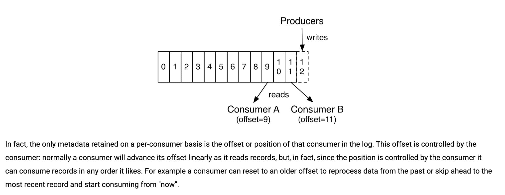

# 消息模型

## 队列模型

早期的消息模型，**使用队列作为消息通信载体，满足生产者与消费者模式，一条消息只能被一个消费者使用**。

## 发布-订阅模型

kafka的消息模型，使用主题（Topic）作为消息通信载体，**发布者发布一条消息，通过主题传递给所有订阅者**。

# Kafka

## 组件

1. **Producer（生产者）** : 产生消息的一方。
2. **Consumer（消费者）** : 消费消息的一方。
3. **Broker（代理）** : 可以看作是一个独立的 Kafka 实例。多个 Kafka Broker 组成一个 Kafka Cluster。

Broker中又包含

- **Topic（主题）** : Producer 将消息发送到特定的主题，Consumer 通过订阅特定的 Topic(主题) 来消费消息。
- **Partition（分区）** : Partition 属于 Topic 的一部分。一个 Topic 可以有多个 Partition ，并且同一 Topic 下的 Partition 可以分布在不同的 Broker 上，这也就表明一个 Topic 可以横跨多个 Broker 。这正如我上面所画的图一样。

> 理解：Partition实际上对应消息队列中的队列

## 多副本机制

分区（Partition）中的多个副本之间会有一个叫做 leader 的家伙，其他副本称为 follower。**我们发送的消息会被发送到 leader 副本，然后 follower 副本才能从 leader 副本中拉取消息进行同步。**

好处

1. Kafka 通过给特定 Topic 指定多个 Partition, 而各个 Partition 可以分布在不同的 Broker 上, 这样便能提供比较好的并发能力（负载均衡）。
2. Partition 可以指定对应的 Replica 数, 这也极大地提高了消息存储的安全性, 提高了容灾能力，不过也相应的增加了所需要的存储空间。

## 如何保证消息消费顺序？

1. 1 个 Topic 只对应一个 Partition。
2. **（推荐）发送消息的时候指定 key/Partition。**

## 如何保证消息不丢失？

### 生产者丢失消息

通过回调函数重新发送，可以设置重试次数，一般为3.

### 消费者丢失消息

**偏移量（offset)表示 Consumer 当前消费到的 Partition(分区)的所在的位置。Kafka 通过偏移量（offset）可以保证消息在分区内的顺序性。**

**消费者消费消息的时候自动提交offset，但是突然挂掉，消息实际没有被消费。**

解决：手动关闭自动提交offset。但是消费完消息，可能被消费两次。

### Kafka弄丢了消息

假如 leader 副本所在的 broker 突然挂掉，那么就要从 follower 副本重新选出一个 leader ，但是 leader 的数据还有一些没有被 follower 副本的同步的话，就会造成消息丢失。

解决

1. acks=all，生产者确保所有leader副本接收才算成功
2. replication.factor >= 3，保证每个分区有3个副本
3. min.insync.replicas > 1，消息至少被写入到2个副本才算是被成功发送

## 如何保证消息不重复消费？

**kafka出现消息重复消费的原因：**

- 服务端侧已经消费的数据没有成功提交 offset（根本原因）。
- Kafka 侧 由于服务端处理业务时间长或者网络链接等等原因让 Kafka 认为服务假死，触发了分区 rebalance。

**解决方案：**

- 消费消息服务做幂等校验，比如 Redis 的set、MySQL 的主键等天然的幂等功能。这种方法最有效。
- 将 `enable.auto.commit`参数设置为 false，关闭自动提交，开发者在代码中手动提交 offset。那么这里会有个问题：什么时候提交offset合适？
  - 处理完消息再提交：依旧有消息重复消费的风险，和自动提交一样
  - 拉取到消息即提交：会有消息丢失的风险。允许消息延时的场景，一般会采用这种方式。然后，通过定时任务在业务不繁忙（比如凌晨）的时候做数据兜底。