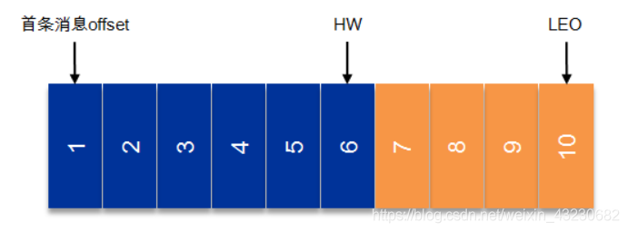

# 消息模型

## 队列模型

早期的消息模型，**使用队列作为消息通信载体，满足生产者与消费者模式，一条消息只能被一个消费者使用**。

## 发布-订阅模型

kafka的消息模型，使用主题（Topic）作为消息通信载体，**发布者发布一条消息，通过主题传递给所有订阅者**。

# Kafka

## 组件

1. **Producer（生产者）** : 产生消息的一方。
2. **Consumer（消费者）** : 消费消息的一方。
3. **Broker（代理）** : 可以看作是一个独立的 Kafka 实例。多个 Kafka Broker 组成一个 Kafka Cluster。

Broker中又包含

- **Topic（主题）** : Producer 将消息发送到特定的主题，Consumer 通过订阅特定的 Topic(主题) 来消费消息。
- **Partition（分区）** : Partition 属于 Topic 的一部分。一个 Topic 可以有多个 Partition ，并且同一 Topic 下的 Partition 可以分布在不同的 Broker 上，这也就表明一个 Topic 可以横跨多个 Broker 。这正如我上面所画的图一样。

> 1. Partition实际上对应消息队列中的队列。
>
> 2. kafka一般通过Zookeeper管理集群配置，选取leader，以及consumer group发生变化时进行rebalance。
> 3. Kafka中消息是以topic进行分类的，生产者生产消息，消费者消费消息，都是面向topic的。

## 文件存储机制

Kafka中消息是以topic进行分类的，生产者生产消息，消费者消费消息，都是**面向topic**的。

==**topic是逻辑上的概念，而partition是物理上的概念**，**每个partition对应于一个log文件**，该log文件中存储的就是**producer生产的数据**。Producer生产的数据会被不断**追加到该log文件末端**，且**每条数据都有自己的offset**。消费者组中的每个**消费者，都会实时记录自己消费到了哪个offset**，以便出错恢复时，从上次的位置继续消费。==

由于生产者生产消息会不断追加至log文件末尾，为防止log文件过大导致数据定位效率低下，**Kafka采取分片和索引机制**，每个partition分为多个segment。**每个segment对应两个文件：`.index`和`.log`文件**。`.index`存储索引信息，`.log`存储数据，**索引文件中的元数据指向对应数据文件中message的物理偏移地址**。`.index`和`.log`文件以当前segment第一条消息的offset命名。如下图：

## 多副本机制

每个Topic的partition有N个副本，Partition中的多个副本之间会有一个叫做 leader 的家伙，其他副本称为 follower。**我们发送的消息会被发送到 leader 副本，然后 follower 副本才能从 leader 副本中拉取消息进行同步。**

好处

1. Kafka 通过给特定 Topic 指定多个 Partition, 而各个 Partition 可以分布在不同的 Broker 上, 这样便能提供比较好的并发能力（负载均衡）。
2. Partition 可以指定对应的 Replica 数, 这也极大地提高了消息存储的安全性, 提高了容灾能力，不过也相应的增加了所需要的存储空间。

如下图，复制因子（副本个数）为3

## AR、ISR、LEO、HW

- **AR**：  Assigned Replicas，是每个partition下所有副本（replicas）的统称。
- **ISR**： In-Sync Replicas，副本同步队列，与leader副本保持一定程度同步的副本，ISR是AR中的一个子集，**由leader维护**。
- OSR：Outof-Sync Replicas，对leader副本同步滞后过多的副本的集合，ISR落后太多就变成了OSR，追上就变成ISR。
- LEO：LogEndOffset，表示每个partition的log最后一条Message的位置。
- HW： HighWatermark，是指consumer能够看到的此partition的位置。 取一个partition对应的ISR中最小的LEO作为HW，consumer最多只能消费到HW所在的位置。

每个replica都有自己的HW，leader和follower各自负责更新自己的HW的状态。对于leader新写入的消息，consumer不能立刻消费，leader会等待该消息被所有ISR中的replicas同步后更新HW，此时消息才能被consumer消费。这样就保证了如果leader所在的broker失效，该消息仍然可以从新选举的leader中获取。对于来自内部broker的读取请求，没有HW的限制。

## 只保留ms作为ISR副本管理参数？

**Q：为什么在Kafka 0.9.0.0版本后移除了replica.lag.max.messages参数而只保留了replica.lag.time.max.ms作为ISR中副本管理的参数呢？**(下文中用messages和ms代替)

A：`messages`表示当前某个副本落后leader的消息数量超过了这个参数的值，那么leader就会把follower从ISR中删除。一般情况下，follower落后leader不会超过messages，但是producer发起瞬时高峰流量，producer一次发送的消息超过`messages`，此时follower都会被认为是与leader副本不同步了，从而被踢出了ISR。但实际上这些follower都是存活状态的且没有性能问题。那么在之后追上leader,并被重新加入了ISR。于是就会出现它们不断地剔出ISR然后重新回归ISR，这无疑增加了无谓的性能损耗。而且这个参数是broker全局的。设置太大了，影响真正落后follower的移除；设置的太小了，导致follower的频繁进出。无法给定一个合适的`messages`的值，故此，新版本的Kafka移除了这个参数。

## 如何保证消息消费顺序？

1. 1 个 Topic 只对应一个 Partition。
2. **（推荐）发送消息的时候指定 key/Partition。**

## 如何保证消息不丢失？

### 生产者丢失消息

通过回调函数重新发送，可以设置重试次数，一般为3.

### 消费者丢失消息

**偏移量（offset)表示 Consumer 当前消费到的 Partition(分区)的所在的位置。Kafka 通过偏移量（offset）可以保证消息在分区内的顺序性。**

**消费者消费消息的时候自动提交offset，但是突然挂掉，消息实际没有被消费。**

解决：手动关闭自动提交offset。但是消费完消息，可能被消费两次。

### Kafka弄丢了消息

假如 leader 副本所在的 broker 突然挂掉，那么就要从 follower 副本重新选出一个 leader ，但是 leader 的数据还有一些没有被 follower 副本的同步的话，就会造成消息丢失。

解决

1. acks=all，生产者确保所有leader副本接收才算成功
2. replication.factor >= 3，保证每个分区有3个副本
3. min.insync.replicas > 1，消息至少被写入到2个副本才算是被成功发送

## 如何保证消息不重复消费？

**kafka出现消息重复消费的原因：**

- 服务端侧已经消费的数据没有成功提交 offset（根本原因）。
- Kafka 侧 由于服务端处理业务时间长或者网络链接等等原因让 Kafka 认为服务假死，触发了分区 rebalance。

**解决方案：**

- 消费消息服务做幂等校验，比如 Redis 的set、MySQL 的主键等天然的幂等功能。这种方法最有效。
- 将 `enable.auto.commit`参数设置为 false，关闭自动提交，开发者在代码中手动提交 offset。那么这里会有个问题：什么时候提交offset合适？
  - 处理完消息再提交：依旧有消息重复消费的风险，和自动提交一样
  - 拉取到消息即提交：会有消息丢失的风险。允许消息延时的场景，一般会采用这种方式。然后，通过定时任务在业务不繁忙（比如凌晨）的时候做数据兜底。