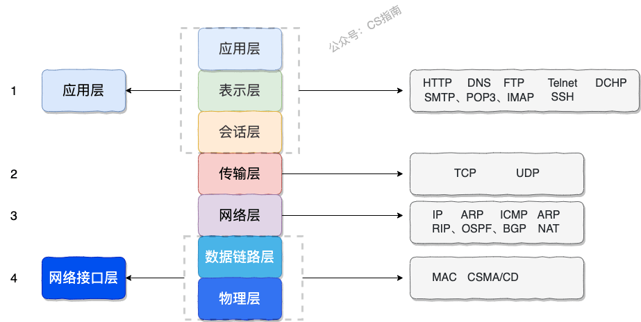
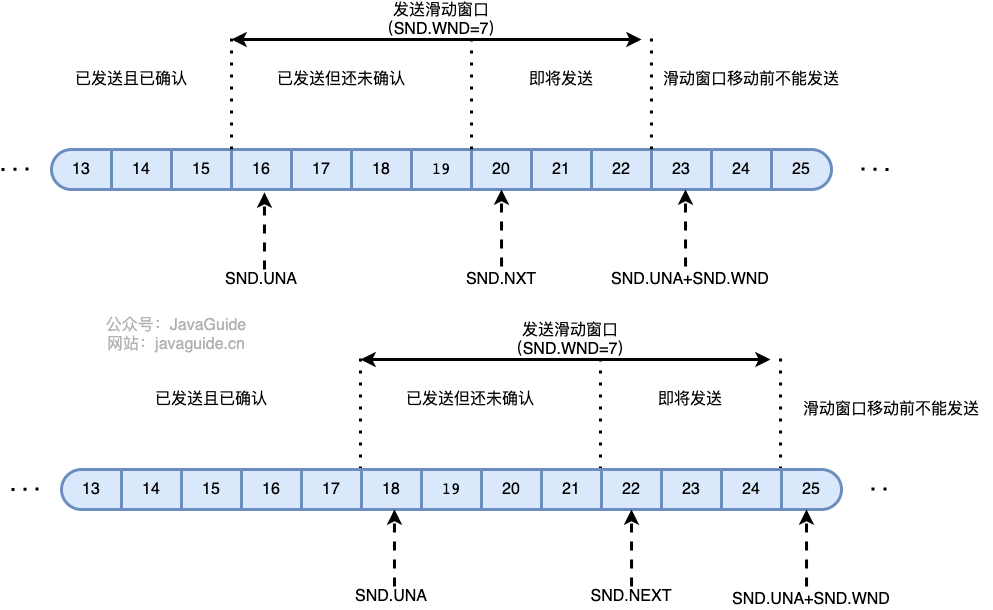
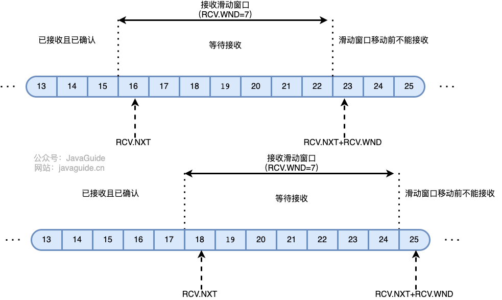
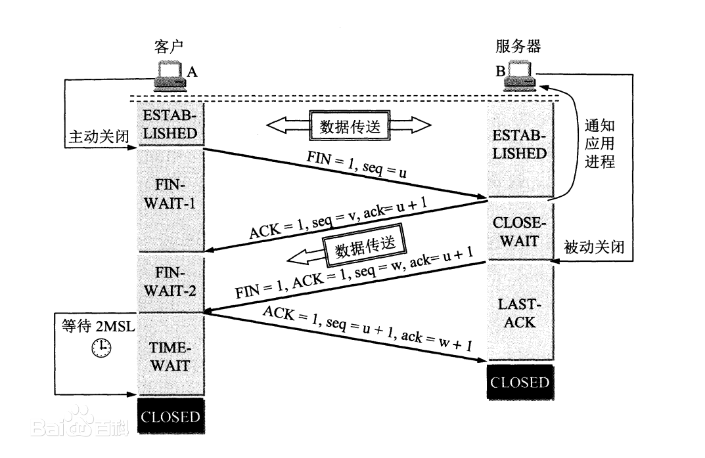
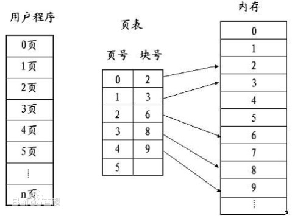
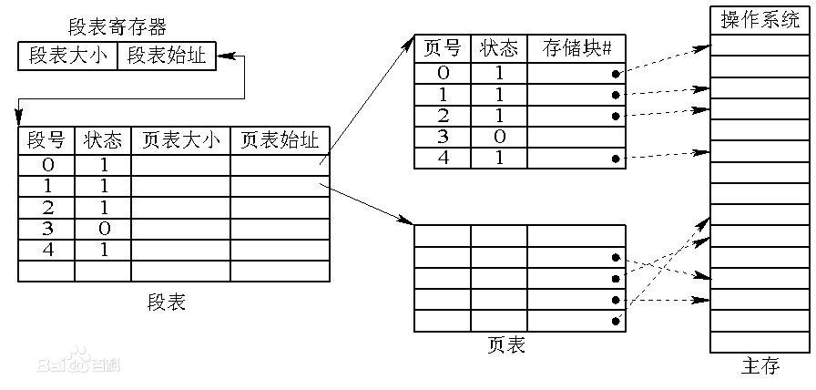
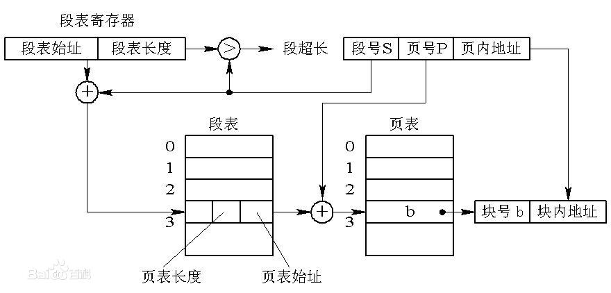

# 计算机网络

## 计网基础

### 1. OSI和TCP/IP网络分层模型

OSI：

#### 1.1 TCP/IP 四层模型

主要分为四层：1.应用层 2.传输层 3.网络层 4.网络接口层

**应用层作用**：主要提供两个终端设备上的应用程序之间信息交换服务，定义了数据交换的格式，交给下一层传输层来传输。应用层交互的数据单元称为报文

**传输层（运输层）**：主要任务是负责向两台终端设备进程之间的通信提供通用的数据传输服务。主要提供两种协议：1.传输控制协议（TCP）：提供**面向连接**，可靠的数据传输服务 2.用户数据协议（UDP）提供**无连接**的，**尽最大努力交付**的数据传输服务。

**网络层**：1.负责为分组交换网上的不同主机提供通信服务。2. **选择合适的路由，使源主机运输层所传下来的分组，能通过网络层中的路由器找到目的主机**。由于网络层使用 IP 协议，因此分组也叫 **IP 数据报**，简称**数据报**。

**网络接口层**：可以把网络接口层看作是数据链路层和物理层的合体。

1. 数据链路层作用：将网络层交下来的 IP 数据报组装成帧，在两个相邻节点间的链路上传送帧。每一帧包括数据和必要的控制信息（如同步信息，地址信息，差错控制等）。

2. 物理层的作用：实现相邻计算机节点之间比特流的透明传送，尽可能屏蔽掉具体传输介质和物理设备的差异

#### 1.2 各层协议

**应用层协议**：HTTP 协议（超文本传输协议，网页浏览常用的协议）DHCP 协议（动态主机配置）DNS 系统原理（域名系统）FTP 协议（文件传输协议）Telnet协议（远程登陆协议）电子邮件协议等（SMTP、POP3、IMAP）SSH协议

**传输层协议**：

1. TCP 协议：报文段结构、可靠数据传输、流量控制、拥塞控制
2. UDP 协议：报文段结构、RDT（可靠数据传输协议）

**网络层协议**：IP 协议（TCP/IP 协议的基础，分为 IPv4 和 IPv6）ARP 协议（地址解析协议，用于解析 IP 地址和 MAC 地址之间的映射）ICMP 协议（控制报文协议，用于发送控制消息）NAT 协议（网络地址转换协议）RIP 协议、OSPF 协议、BGP 协议（路由选择协议）

**网络接口层**：差错检测技术、多路访问协议（信道复用技术）、CSMA/CD 协议、MAC 协议、以太网技术

### 2.【重要】TCP三次握手

#### 2.1 三次握手过程

一次握手：客户端发送带有`SYN=1`标志的数据包给服务端，其中`seq=x`，==客户端进入`SYN_SEND`状态==

二次握手：服务端收到客户端发送的数据包后，发送带有`SYN=1, ACK=1`标志的数据包给客户端，其中`seq=y, ack=x+1`，==服务端进入`SYN_RECV`状态。==

三次握手：客户端收到服务端发送的数据包后，发送`ACK=1`数据包给服务端，其中`ack=y+1`。==客户端进入`ESTABLISHED`状态，服务端收到后也进入`ESTABLISHED`状态==，完成三次握手。

#### 2.2 为什么要三次握手？

三次握手的目的是简历可靠的通信信道，说到通讯，简单来说就是数据的发送和接收，三次握手的目的就是**双方确认自己与对方的发送与接收是正常的。**

1. **第一次握手** ：Client 什么都不能确认；Server 确认了对方发送正常，自己接收正常
2. **第二次握手** ：Client 确认了：自己发送、接收正常，对方发送、接收正常；Server 确认了：对方发送正常，自己接收正常
3. **第三次握手** ：Client 确认了：自己发送、接收正常，对方发送、接收正常；Server 确认了：自己发送、接收正常，对方发送、接收正常

#### 2.3 TCP如何实现传输可靠性？

**基于数据块传输** ：应用数据被分割成 TCP 认为最适合发送的数据块，再传输给网络层，数据块被称为报文段或段。

**对失序数据包重新排序以及去重**：TCP 为了保证不发生丢包，就给每个包一个序列号，有了序列号能够将接收到的数据根据序列号排序，并且去掉重复序列号的数据就可以实现数据包去重。

**校验和** : TCP 将保持它首部和数据的检验和。这是一个端到端的检验和，目的是检测数据在传输过程中的任何变化。如果收到段的检验和有差错，TCP 将丢弃这个报文段和不确认收到此报文段。

**超时重传** : 当发送方发送数据之后，它启动一个定时器，等待目的端确认收到这个报文段。接收端实体对已成功收到的包发回一个相应的确认信息（ACK）。如果发送端实体在合理的往返时延（RTT）内未收到确认消息，那么对应的数据包就被假设为[已丢失](https://zh.wikipedia.org/wiki/丢包)并进行重传。

**流量控制** : TCP 连接的每一方都有固定大小的缓冲空间，TCP 的接收端只允许发送端发送接收端缓冲区能接纳的数据。当接收方来不及处理发送方的数据，能提示发送方降低发送的速率，防止包丢失。TCP 使用的流量控制协议是可变大小的滑动窗口协议（TCP 利用滑动窗口实现流量控制）。

**拥塞控制** : 当网络拥塞时，减少数据的发送。

#### 2.4 TCP流量控制

TCP利用**滑动窗口**实现流量控制。**流量控制是为了控制发送方发送速率，保证接收方来得及接收。**

客户端和服务端**各有一个发送缓冲区与接收缓冲区**，两端都各自**维护一个发送窗口和一个接收窗口**。

接收方发送的**确认报文中的窗口字段**可以用来控制发送方窗口大小，从而影响发送方的发送速率。**接收窗口的大小是根据接收端处理数据的速度动态调整的。** 如果接收端读取数据快，接收窗口可能会扩大。 否则，它可能会缩小。

TCP 发送窗口可以划分成四个部分 ：

1. 已经发送并且确认的TCP段（已经发送并确认）；
2. 已经发送但是没有确认的TCP段（已经发送未确认）；
3. 未发送但是接收方准备接收的TCP段（可以发送）；
4. 未发送并且接收方也并未准备接受的TCP段（不可发送）。

**可用窗口大小** = `SND.UNA + SND.WND - SND.NXT` 。

**TCP 接收窗口可以划分成三个部分** ：

1. 已经接收并且已经确认的 TCP 段（已经接收并确认）；
2. 等待接收且允许发送方发送 TCP 段（可以接收未确认）；
3. 不可接收且不允许发送方发送TCP段（不可接收）。

如果接收方没有能力接收数据，就会将接收窗口设置为0，这时发送方必须暂停发送数据，但是会启动一个**持续计时器(persistence timer)**，到期后发送一个大小为1字节的探测数据包，以查看接收窗口状态。如果接收方能够接收数据，就会在返回的报文中更新接收窗口大小，恢复数据传送。

#### 2.5 TCP的拥塞控制是怎么实现的？

拥塞控制是为了防止过多的数据注入到网络中，拥塞控制是一个全局性的过程，涉及到所有的主机，所有的路由器；流量控制往往是点对点通信量的控制，是个端到端的问题。

为了进行拥塞控制，TCP 发送方要维持一个 **拥塞窗口(cwnd)** 的状态变量。拥塞控制窗口的大小取决于网络的拥塞程度，并且动态变化。**发送方让自己的发送窗口取为拥塞窗口和接收方的接受窗口中较小的一个**。

TCP 的拥塞控制采用了四种算法，即 **慢开始** 、 **拥塞避免** 、**快重传** 和 **快恢复**。

- **慢开始：** 慢开始算法的思路是当主机开始发送数据时，如果立即把大量数据字节注入到网络，那么可能会引起网络阻塞，因为现在还不知道网络的符合情况。经验表明，较好的方法是先探测一下，即由小到大逐渐增大发送窗口，也就是由小到大逐渐增大拥塞窗口数值。cwnd 初始值为 1，每经过一个传播轮次，cwnd 加倍。
- **拥塞避免：** 拥塞避免算法的思路是让拥塞窗口 cwnd 缓慢增大，即每经过一个往返时间 RTT 就把发送方的 cwnd 加 1.
- **快重传与快恢复：** 在 TCP/IP 中，快速重传和恢复（fast retransmit and recovery，FRR）是一种拥塞控制算法，它能快速恢复丢失的数据包。没有 FRR，如果数据包丢失了，TCP 将会使用定时器来要求传输暂停。在暂停的这段时间内，没有新的或复制的数据包被发送。有了 FRR，如果接收机接收到一个不按顺序的数据段，它会立即给发送机发送一个重复确认。如果发送机接收到三个重复确认，它会假定确认件指出的数据段丢失了，并立即重传这些丢失的数据段。有了 FRR，就不会因为重传时要求的暂停被耽误。 　当有单独的数据包丢失时，快速重传和恢复（FRR）能最有效地工作。当有多个数据信息包在某一段很短的时间内丢失时，它则不能很有效地工作。

#### 2.6 ARQ协议

**自动重传请求**（Automatic Repeat-reQuest，ARQ）是 OSI 模型中数据链路层和传输层的错误纠正协议之一。ARQ 包括停止等待 ARQ 协议和连续 ARQ 协议。

停止等待协议是为了实现可靠传输的，它的基本原理就是每发完一个分组就停止发送，等待对方确认（回复 ACK）。如果过了一段时间（超时时间后），还是没有收到 ACK 确认，说明没有发送成功，需要重新发送，直到收到确认后再发下一个分组

连续 ARQ 协议可提高信道利用率。**发送方维持一个发送窗口**，凡位于发送窗口内的分组可以连续发送出去，而不需要等待对方确认。**接收方一般采用累计确认，对按序到达的最后一个分组发送确认**，表明到这个分组为止的所有分组都已经正确收到了。

### 3.【重要】TCP四次挥手

#### **3.1 四次挥手过程**

一次挥手：客户端发送带有`FIN=1`标志的数据包给服务端，其中`seq=u`，客户端进入`FIN-WAIT-1`状态。

二次挥手：服务端收到客户端发送的数据包后，发送带有`ACK=1`标志的数据包，其中`seq=v, ack=u+1`，服务端进入`CLOSE-WAIT`状态

三次挥手：服务端发送完剩余数据后，向客户端发送带有`FIN=1,ACK=1`标志的数据包，其中`seq=w, ack=u+1`，服务端进入`LAST-ACK`状态

四次挥手：客户端收到服务端发送的数据包后，发送带有`ACK=1`标志的数据包，其中`seq=u+1, ack=w+1`，服务端收到客户端发送的数据包后，进入`CLOSE`状态，客户端在等待2MSL后没有收到回复，随后也进入`CLOSE`状态，就是关闭连接。

#### 3.2 为什么要四次挥手？

TCP是全双工通信，可以双向传输数据。任何一方都可以在数据传送结束后发出连接释放的通知，待对方确认后进入半关闭状态。当另一方也没有数据再发送的时候，则发出连接释放通知，对方确认后就完全关闭了 TCP 连接。

#### 3.3 为什么不能把服务器发送的ACK和FIN合并变成三次挥手？

因为服务器收到客户端断开连接的请求时，可能还有一些数据没有发完，这时先回复 ACK，表示接收到了断开连接的请求。等到数据发完之后再发 FIN，断开服务器到客户端的数据传送。

#### 3.4 为什么第四次挥手客户端需要等待 2*MSL（报文段最长寿命）时间后才进入 CLOSED 状态？

第四次挥手时，客户端发送给服务器的 ACK 有可能丢失，如果服务端因为某些原因而没有收到 ACK 的话，服务端就会重发 FIN，如果客户端在 2*MSL 的时间内收到了 FIN，就会重新发送 ACK 并再次等待 2MSL，防止 Server 没有收到 ACK 而不断重发 FIN。

> MSL（Maximum Segment Lifetime）一个片段在网络中的最大存活时间。

### 4. 【重要】HTTP和HTTPS

#### 4.1 HTTP介绍

HTTP协议，全称超文本传输协议（Hyper Text Transfer Protocol）顾名思义，HTTP 协议就是用来规范超文本的传输，主要是来**规范浏览器和服务器端**的行为的。HTTP 是一个无状态（stateless）协议，也就是说服务器不维护任何有关客户端过去所发请求的消息。

HTTP协议是**应用层协议**，它以 **TCP（传输层）**作为底层协议，**默认端口为 80**。

**优点**：扩展性强、速度快、跨平台支持性好

#### 4.2 HTTPS介绍

HTTPS 协议（Hyper Text Transfer Protocol Secure），是 HTTP 的加强安全版本。HTTPS 是基于 HTTP 的，也是用 TCP 作为底层协议，并额外使用 SSL/TLS 协议用作加密和安全认证。默认端口号是 443。

**优点**：保密性好、信任度高。

#### HTTP和HTTPS区别

1. 端口号：HTTP默认是80，HTTPS默认是443
2. URL前缀：HTTP的URL前缀是`http://`，HTTPS是`https://`
3. 安全性和资源消耗：HTTP 协议运行在 TCP 之上，所有传输的内容都是明文，客户端和服务器端都无法验证对方的身份。HTTPS 是运行在 SSL/TLS 之上的 HTTP 协议，SSL/TLS 运行在 TCP 之上。所有传输的内容都经过加密，加密采用对称加密，但对称加密的密钥用服务器方的证书进行了非对称加密。所以说，HTTP 安全性没有 HTTPS 高，但是 HTTPS 比 HTTP 耗费更多服务器资源。

#### 4.3 SSL/TLS的工作原理

SSL/TLS 的核心要素是**非对称加密**。非对称加密采用两个密钥——一个公钥，一个私钥。在通信时，私钥仅由解密者保存，公钥由任何一个想与解密者通信的发送者（加密者）所知。

公私钥对的生成算法依赖于**单向陷门函数**。

>单向函数：已知单向函数 f，给定任意一个输入 x，易计算输出 y=f(x)；而给定一个输出 y，假设存在 f(x)=y，很难根据 f 来计算出 x。
>
>单向陷门函数：一个较弱的单向函数。已知单向陷门函数 f，陷门 h，给定任意一个输入 x，易计算出输出 y=f(x;h)；而给定一个输出 y，假设存在 f(x;h)=y，很难根据 f 来计算出 x，但可以根据 f 和 h 来推导出 x。
>
>在这里，函数 f 的计算方法相当于公钥，陷门 h 相当于私钥。

SSL/TLS 实际对消息的加密使用的是**对称加密**。

> 对称加密：通信双方共享唯一密钥 k，加解密算法已知，加密方利用密钥 k 加密，解密方利用密钥 k 解密，保密性依赖于密钥 k 的保密性。

使用**非对称加密**，对**对称加密的密钥**进行加密，保护该密钥不在网络信道中被窃听。这样，通信双方只需要**一次非对称加密**，交换**对称加密的密钥**，在之后的信息通信中，使用绝对安全的密钥，对信息进行对称加密，即可保证传输消息的保密性。

为了公钥传输的信赖性问题，第三方机构应运而生——证书颁发机构（CA，Certificate Authority）。CA 默认是受信任的第三方。CA 会给各个服务器颁发证书，证书存储在服务器上，并附有 CA 的**电子签名**。

带有证书的公钥传输机制如下：

1. 设有服务器 S，客户端 C，和第三方信赖机构 CA。
2. S 信任 CA，CA 是知道 S 公钥的，CA 向 S 颁发证书。并附上 CA 私钥对消息摘要的加密签名。
3. S 获得 CA 颁发的证书，将该证书传递给 C。
4. C 获得 S 的证书，信任 CA 并知晓 CA 公钥，使用 CA 公钥对 S 证书上的签名解密，同时对消息进行散列处理，得到摘要。比较摘要，验证 S 证书的真实性。
5. 如果 C 验证 S 证书是真实的，则信任 S 的公钥（在 S 证书中）。

P.S. 当客户端使用CA公钥解密数字证书中的摘要值之后，得到的应该是证书颁发者对公钥和其他信息所生成的数字签名。此时，客户端需要将这个数字签名（即解密后得到的摘要值）与数字证书的原始数据（即公钥、证书颁发者信息等）进行计算，得到一个新的数字摘要值。然后，客户端可以将这个新的数字摘要值与数字证书中签名的摘要值进行比对，以验证数字证书的真实性。

#### 4.4 SSL/TLS握手过程

1. 客户端给出协议版本号、一个客户端生成的随机数（Client random），以及客户端支持的加密方法。
2. 服务端确认双方使用的加密方法，并给出数字证书、以及一个服务器生成的随机数（Server random）。
3. 客户端确认数字证书有效，然后生成一个新的随机数（Premaster secret），并使用数字证书中的公钥，加密这个随机数，发给鲍勃。
4. 服务端使用自己的私钥，获取客户端发来的随机数（即Premaster secret）。
5. 客户端和服务端根据约定的加密方法，使用前面的三个随机数，生成"对话密钥"（session key），用来加密接下来的整个对话过程。

#### 4.5 session的恢复

握手阶段用来建立SSL连接。如果出于某种原因，对话中断，就需要重新握手。这时有两种方法可以恢复原来的session：一种叫做**session ID**，另一种叫做**session ticket**。

session ID的思想很简单，就是每一次对话都有一个编号（session ID）。如果对话中断，下次重连的时候，只要客户端给出这个编号，且服务器有这个编号的记录，双方就可以重新使用已有的"对话密钥"，而不必重新生成一把。

session ID是目前所有浏览器都支持的方法，但是它的缺点在于session ID往往只保留在一台服务器上。所以，如果客户端的请求发到另一台服务器，就无法恢复对话。session ticket就是为了解决这个问题而诞生的。

session ticket：客户端不再发送session ID，而是发送一个服务器在上一次对话中发送过来的session ticket。这个session ticket是加密的，只有服务器才能解密，其中包括本次对话的主要信息，比如对话密钥和加密方法。当服务器收到session ticket以后，解密后就不必重新生成对话密钥了。

#### 4.6 HTTP常见状态码

1xx Informational（信息性状态码）

2xx Success（成功状态码）

- **200 OK** ：请求被成功处理。比如我们发送一个查询用户数据的HTTP 请求到服务端，服务端正确返回了用户数据。这个是我们平时最常见的一个 HTTP 状态码。
- **201 Created** ：请求被成功处理并且在服务端创建了一个新的资源。比如我们通过 POST 请求创建一个新的用户。
- **202 Accepted** ：服务端已经接收到了请求，但是还未处理。
- **204 No Content** ： 服务端已经成功处理了请求，但是没有返回任何内容。

3xx Redirection（重定向状态码）

- **301 Moved Permanently** ： 资源被永久重定向了。比如你的网站的网址更换了。
- **302 Found** ：资源被临时重定向了。比如你的网站的某些资源被暂时转移到另外一个网址。

4xx Client Error（客户端错误状态码）

- **400 Bad Request** ： 发送的HTTP请求存在问题。比如请求参数不合法、请求方法错误。
- **401 Unauthorized** ： 未认证却请求需要认证之后才能访问的资源。
- **403 Forbidden** ：直接拒绝HTTP请求，不处理。一般用来针对非法请求。
- **404 Not Found** ： 你请求的资源未在服务端找到。比如你请求某个用户的信息，服务端并没有找到指定的用户。
- **409 Conflict** ： 表示请求的资源与服务端当前的状态存在冲突，请求无法被处理。

5xx Server Error（服务端错误状态码）

- **500 Internal Server Error** ： 服务端出问题了（通常是服务端出Bug了）。比如你服务端处理请求的时候突然抛出异常，但是异常并未在服务端被正确处理。
- **502 Bad Gateway** ：我们的网关将请求转发到服务端，但是服务端返回的却是一个错误的响应。

#### 4.7 浏览器输入地址，到页面展示经历了什么？

1. 浏览器输入url。先解析url地址是否合法

2. 浏览器检查是否有缓存（游览器缓存-系统缓存-路由器缓存）。如果有，直接显示。如果没有，跳到第三步。

3. 在发送http请求前，需要域名解析（DNS解析），解析获取对应过的ip地址。
4. 浏览器向服务器发起tcp链接，与浏览器简历tcp三次握手
5. 握手成功后，浏览器向服务器发送http请求，请求数据包
6. 服务器收到处理的请求，将数据返回至浏览器
7. 浏览器收到http响应。
8. 浏览器解析响应。如果响应可以缓存，则存入缓存
9. 页面全部渲染结束。

#### 4.8 HTTP各个版本间的差别

**0.9版本**

1. 只支持GET请求
2. 只支持传输HTML的数据格式

**1.0版本**

1. 支持GET、POST和HEAD
2. 传输数据的标志是明文，缺乏安全性。
3. 不支持长连接，每进行一次请求响应后就会断开TCP连接。

**1.1版本**【主流】

1. 持久性连接，即TCP连接不关闭，可以在单个TCP连接上进行多个请求和响应。
2. 管道机制，可以连续发送请求而不必等待请求响应后再发送请求。（同一个TCP连接，客户端可以发送多个请求）
3. 增加了更多的协议头, 让协议支持更多的协商内容, 比如浏览器和服务器沟通资源缓存相关的操作

缺点：

1. 会造成队头阻塞问题，服务器是按照请求的顺序响应的, 如果服务器第一个响应处理时间长
2. 请求只能从客户端开始，服务端被动响应
3. 发送消息带有冗长的首部，每次发送相同的首部浪费资源

**2.0版本**

1. 二进制传输（1.1 版本是通过文本进行传输，内容不能分开传递，2.0版本将请求的数据转换成二进制格式，然后标记索引，将数据包分成一片一片，相当于并发传输数据给到服务端）
2. 采用多路复用，支持并发传输（多个请求通过一个 TCP 连接）
3. 头部压缩  （使用HPACK算法，在客户端和服务端维护一张头部信息表，通过索引来将多个请求中的请求字段合并，传递时，只需传递索引即可）
4. 服务器端推送（浏览器刚请求 HTML 时，就会把可能用到的 CSS JS 发送给客户端，减少等待的延迟）

缺点：解决了应用层的队头阻塞问题，TCP层面队头阻塞

**3.0版本**

基于谷歌的QUIC，**底层是基于UDP协议**

1. 基于UDP，提高了传输效率，降低延迟（没有三次握手，四次挥手）
2. 使用stream进一步扩展HTTP2.0 的多路复用，传输多少文件就可以产生多少stream，若发生丢包，只需要传输丢失的stream

**总结**

从HTTP1.1开始, HTTP1.1存在头部冗余, 队头阻塞问题, HTTP2.0改用流的方式传输, 并且使用头部压缩和维护头部字典的方式改进了HTTP1.1协议存在的问题

而剩下的TCP协议存在的队头阻塞问题被HTTP3.0通过更换传输层协议为UDP并使用QUIC协议来实现可靠数据传输和数据流传输, 在解决了TCP的队头阻塞问题的基础上还保证了数据的可靠传输, 同时还在HTTP2.0头部压缩的基础上进一步升级优化, 更加提高了HTTP协议传输的效率

#### 4.9 HTTP请求格式

**客户端请求消息**，包括以下格式：请求行、请求头部、空行、请求数据。**服务器响应包括如下格式**：状态行、消息报头、空行、响应正文

1. 请求方法：GET、POST、PUT、DELETE、HEAD、CONNECT、OPTIONS、TRACE
2. 请求行：请求方法（如GET） + 空格 + url
3. GET方法的请求头部：
   - Accept：表示客户端接受的内容类型，按照先后顺序表示客户端接收数据的先后次序
   -  X-Requested-With：以x开头的是非http标准，一般是某种技术的出现而定义的；这里是用来判断是http请求还是ajax请求。
   - Referer：从这个页面访问请求行里的url
   - Accept-Language：客户端接受内容返回优先选择的语言
   - Accept-Encoding：客户端可以接受的服务器对返回内容进行编码压缩的格式。
   - **User-Agent**：客户端运行的浏览器类型信息。
   - **Host**：头域指定请求的服务器的地址和端口，HTTP/1.1必须包括Host，否则返回400
   - **Connection**：表示是否需要持久连接。如果web服务器端看到这里的值为“Keep-Alive”，或者看到请求使用的是HTTP 1.1（HTTP 1.1默认进行持久连接），它就可以利用持久连接的优点，当页面包含多个元素时（例如Applet，图片），显著地减少下载所需要的时间。要实现这一点， web服务器需要在返回给客户端HTTP头信息中发送一个Content-Length（返回信息正文的长度）头，最简单的实现方法是：先把内容写入ByteArrayOutputStream，然 后在正式写出内容之前计算它的大小。
   - **Cookie**：http请求时，会把保存的cookie也发送服务器。cookie是保存在客户端里的，分为内存cookie和硬盘cookie。前者随着浏览器关闭而消失，后者由过期时间或者用户手动清除。因为http请求是无状态的，所以服务器为了认证，会生成sessionid，让浏览器setcookie保存起来，每次请求携带上认证信息。
4. 响应的消息报头
   - Server：包含处理请求的服务器信息，包含多个产品注释和标识。
   - Cache-Control：告知缓存机制是否可以缓存和类型，private是只能当前用户，不能被共享。
   - Expires：响应过期时间
   - X-Application-Context：application配置，这里表示读取的是application-prod.properties
   - Content-Type：返回数据的类型和字符编码格式
   - Transfer-Encoding：告知接收端，报文采取了何种编码，chunked表示服务器无法确定消息大小，一般比如下载等，就采用chunked。
   - Date：返回消息的时间
5. POST请求头部
   - Content-Length：告知服务器，请求数据的大小
   - Origin：origin类似refered，但比refered更人性化，origin只出现在post中，而origin也不携带敏感信息和具体url路径。
   - Content-Type：http请求提交内容的编码类型，一般只有post需要设置。application/x-www-form-urlencoded（缺省）和multipart/form-data。

#### 4.10 GET和POST区别

1. 从语义上来看：GET代表获取而POST代表提交，所以GET一般用来获取到我们的数据，然后POST一般代表提交数据。

2. GET方法一般把自定义数据放在我们的quary string中，而我们的POST是把自定义数据放在正文(body)中。

3. GET方法是幂等的，而POST方法不是幂等的。什么是幂等？幂等就是我们随时随地什么时候去访问这个资源，返回的结果是相同的。不幂等就是我们下一次进行访问，我们获取的结果可能是不一样的。

4. GET 可以被缓存, POST 不能被缓存. (这一点也是承接幂等性)

#### 4.11 信息传输的安全

1. 为了防止信息泄露，使用了对称加密算法。

2. 为了免于传输密钥，使用了非对称加密算法。
3. 为了防止信息被篡改，使用了随机散列函数。（HMAC）

# 操作系统

## 进程和线程

### 1. 进程和线程的区别？

 线程是进程划分成的更小的运行单位,一个进程在其执行的过程中可以产生多个线程。线程和进程最大的不同在于基本上各进程是独立的，而各线程则不一定，因为同一进程中的线程极有可能会相互影响。线程执行开销小，但不利于资源的管理和保护；而进程正相反。

### 2. 进程有几种状态？

**创建状态(new)** ：进程正在被创建，尚未到就绪状态。

**就绪状态(ready)** ：进程已处于准备运行状态，即进程获得了除了处理器之外的一切所需资源，一旦得到处理器资源(处理器分配的时间片)即可运行。

**运行状态(running)** ：进程正在处理器上上运行(单核 CPU 下任意时刻只有一个进程处于运行状态)。

**阻塞状态(waiting)** ：又称为等待状态，进程正在等待某一事件而暂停运行如等待某资源为可用或等待 IO 操作完成。即使处理器空闲，该进程也不能运行。

**结束状态(terminated)** ：进程正在从系统中消失。可能是进程正常结束或其他原因中断退出运行。

### 3. 进程间的通信方式？

1. **管道/匿名管道(Pipes)** ：数据只能单向流动，用于具有亲缘关系的父子进程间或者兄弟进程之间的通信。
2. **有名管道(Named Pipes)** : 匿名管道由于没有名字，只能用于亲缘关系的进程间通信。为了克服这个缺点，提出了有名管道。有名管道严格遵循**先进先出(first in first out)**。**有名管道以磁盘文件的方式存在**，可以实现本机任意两个进程通信。
3. **信号(Signal)** ：信号是一种比较复杂的通信方式，用于通知接收进程某个事件已经发生；
4. **消息队列(Message Queuing)** ：消息队列是消息的链表,具有特定的格式,存放在内存中并由消息队列标识符标识。管道和消息队列的通信数据都是先进先出的原则。与管道（无名管道：只存在于内存中的文件；有名管道：存在于实际的磁盘介质或者文件系统）不同的是**消息队列存放在内核**中，只有在内核重启(即，操作系统重启)或者显式地删除一个消息队列时，该消息队列才会被真正的删除。消息队列可以实现消息的随机查询,消息不一定要以先进先出的次序读取,也可以按消息的类型读取.比 FIFO 更有优势。**消息队列克服了信号承载信息量少，管道只能承载无格式字节流以及缓冲区大小受限等缺点。**
5. **信号量(Semaphores)** ：信号量是一个计数器，通常作为一种锁机制，用于多进程对共享数据的访问，信号量的意图在于进程间同步。这种通信方式主要用于解决与同步相关的问题并避免竞争条件。
6. **共享内存(Shared memory)** ：使得多个进程可以访问同一块内存空间，不同进程可以及时看到对方进程中对共享内存中数据的更新。这种方式需要依靠某种同步操作，如互斥锁和信号量等。可以说这是最有用的进程间通信方式。
7. **套接字(Sockets)** : 此方法主要用于在客户端和服务器之间通过网络进行通信。**套接字是支持 TCP/IP 的网络通信的基本操作单元**，可以看做是不同主机之间的进程进行双向通信的端点，简单的说就是通信的两方的一种约定，用套接字中的相关函数来完成通信过程。

### 4. 线程间的同步方式

1. **互斥量(Mutex)**：采用互斥对象机制，只有拥有互斥对象的线程才有访问公共资源的权限。因为互斥对象只有一个，所以可以保证公共资源不会被多个线程同时访问。比如 Java 中的 synchronized 关键词和各种 Lock 都是这种机制。
2. **信号量(Semaphore)** ：它允许同一时刻多个线程访问同一资源，但是需要控制同一时刻访问此资源的最大线程数量。
3. **事件(Event)** :Wait/Notify：通过通知操作的方式来保持多线程同步，还可以方便的实现多线程优先级的比较操作。

### 5. 进程的调度算法

- **先到先服务(FCFS)调度算法** : 从就绪队列中选择一个最先进入该队列的进程为之分配资源，使它立即执行并一直执行到完成或发生某事件而被阻塞放弃占用 CPU 时再重新调度。
- **短作业优先(SJF)的调度算法** : 从就绪队列中选出一个估计运行时间最短的进程为之分配资源，使它立即执行并一直执行到完成或发生某事件而被阻塞放弃占用 CPU 时再重新调度。
- **时间片轮转调度算法** : 时间片轮转调度是一种最古老，最简单，最公平且使用最广的算法，又称 RR(Round robin)调度。每个进程被分配一个时间段，称作它的时间片，即该进程允许运行的时间。
- **多级反馈队列调度算法** ：前面介绍的几种进程调度的算法都有一定的局限性。如**短进程优先的调度算法，仅照顾了短进程而忽略了长进程** 。多级反馈队列调度算法既能使高优先级的作业得到响应又能使短作业（进程）迅速完成。，因而它是目前**被公认的一种较好的进程调度算法**，UNIX 操作系统采取的便是这种调度算法。
- **优先级调度** ： 为每个流程分配优先级，首先执行具有最高优先级的进程，依此类推。具有相同优先级的进程以 FCFS 方式执行。可以根据内存要求，时间要求或任何其他资源要求来确定优先级。

### 6. 死锁的四个必要条件

死锁：多个进程/线程同时被阻塞，它们中的一个或者全部都在等待某个资源释放，被无限期阻塞不能正常终止。

- **互斥**：资源必须处于非共享模式，即一次只有一个进程可以使用。如果另一进程申请该资源，那么必须等待直到该资源被释放为止。
- **占有并等待**：一个进程至少应该占有一个资源，并等待另一资源，而该资源被其他进程所占有。
- **非抢占**：资源不能被抢占。只能在持有资源的进程完成任务后，该资源才会被释放。
- **循环等待**：有一组等待进程 `{P0, P1,..., Pn}`， `P0` 等待的资源被 `P1` 占有，`P1` 等待的资源被 `P2` 占有，......，`Pn-1` 等待的资源被 `Pn` 占有，`Pn` 等待的资源被 `P0` 占有。

### 7. 解决死锁的方法

- **预防** 是采用某种策略，**限制并发进程对资源的请求**，如**静态分配策略**（执行前拿到所需全部资源，破坏占有且等待）、**层次分配策略**（资源分层次，只能申请比当前较高一层的资源，释放需要先释放高层资源，破坏循环等待）。

- **避免** 将系统状态分为**安全状态**和**不安全状态**，系统在分配资源时，根据资源的使用情况**提前做出预测**，从而**避免死锁的发生**，如**银行家算法**。

- **检测**是指系统设有**专门的机构**，当死锁发生时，该机构能够检测死锁的发生，并精确地确定与死锁有关的进程和资源。如**进程-资源分配图**。

- **解除** 是与检测相配套的一种措施，用于**将进程从死锁状态下解脱出来**。

  1. **立即结束所有进程的执行，重新启动操作系统** ：这种方法简单，但以前所在的工作全部作废，损失很大。

  2. **撤销涉及死锁的所有进程，解除死锁后继续运行** ：这种方法能彻底打破**死锁的循环等待**条件，但将付出很大代价，例如有些进程可能已经计算了很长时间，由于被撤销而使产生的部分结果也被消除了，再重新执行时还要再次进行计算。

  3. **逐个撤销涉及死锁的进程，回收其资源直至死锁解除。**

  4. **抢占资源** ：从涉及死锁的一个或几个进程中抢占资源，把夺得的资源再分配给涉及死锁的进程直至死锁解除。

### 8. 协程是什么？

协程是用户视角的一种抽象，操作系统并没有协程的概念。协程运行在线程之上，协程的主要思想是**在用户态实现调度算法，用少量线程完成大量任务的调度。**

## 内存管理

### 1. 常见的几种内存管理机制

1. 块式管理：远古时代将内存分为几个固定大小的块，需要的话就分配一块，浪费较多。
2. 页式管理：将内存分为大小相等且固定的页，页较小，相较块式管理减少了碎片。页式管理通过**页表**对应逻辑地址和物理地址。
3. 段式管理：将内存分为一段一段的，有实际意义，如主程序段MAIN、子程序段X等，通过**段表**对应逻辑地址和物理地址。
4. 段页式管理：结合页式管理和段氏管理的优点，将内存分为若干段，段又分为若干页。

进行地址变换时，首先利用段号S，将它与段表长TL进行比较。若S<TL，表示未越界，于是利用段表始址和段号来求出该段所对应的段表项在段表中的位置，从中得到该段的**页表始址**，并利用逻辑地址中的**段内页号P**来获得对应页的页表项位置，从中读出该页所在的**物理块号b**，再利用**块号b和页内地址**来构成物理地址。

### 2. 快表和多级页表

可以把快表理解为一种特殊的高速缓冲存储器（Cache），由于采用页表做地址转换，读写内存数据时 CPU 要访问两次主存。有了快表，有时只要访问一次高速缓冲存储器，一次主存，这样可加速查找并提高指令执行速度。使用快表之后的地址转换流程是这样的：

1. 根据虚拟地址中的页号查快表；
2. 如果该页在快表中，直接从快表中读取相应的物理地址；
3. 如果该页不在快表中，就访问内存中的页表，再从页表中得到物理地址，同时将页表中的该映射表项添加到快表中；
4. 当快表填满后，又要登记新页时，就按照一定的淘汰策略淘汰掉快表中的一个页。

**多级页表**

引入多级页表的主要目的是为了避免把全部页表一直放在内存中占用过多空间，特别是那些根本就不需要的页表就不需要保留在内存中。

### 3. 逻辑（虚拟）地址和物理地址？

逻辑地址由操作系统决定。物理地址指的是真实物理内存中地址，更具体一点来说就是内存地址寄存器中的地址。物理地址是内存单元真正的地址。

### 4. CPU寻址？为什么需要虚拟地址？

现代处理器使用的是一种称为 **虚拟寻址(Virtual Addressing)** 的寻址方式。**使用虚拟寻址，CPU 需要将虚拟地址翻译成物理地址，这样才能访问到真实的物理内存。** 实际上完成虚拟地址转换为物理地址的硬件是 CPU 中含有一个被称为 **内存管理单元（Memory Management Unit, MMU）** 的硬件。

why？程序可以使用一系列虚拟地址来**访问大于可用物理内存**的内存缓冲区，如果直接把物理地址暴露出来的话会带来严重问题，比如可能对操作系统造成伤害以及给同时运行多个程序造成困难。用户程序可以访问任意内存，寻址内存的每个字节，这样就很容易（有意或者无意）破坏操作系统，造成操作系统崩溃。

通过虚拟地址访问内存有以下优势：

- 程序可以使用一系列相邻的虚拟地址来访问物理内存中不相邻的大内存缓冲区。
- 程序可以使用一系列虚拟地址来**访问大于可用物理内存**的内存缓冲区。当物理内存的供应量变小时，内存管理器会将物理内存页（通常大小为 4 KB）保存到磁盘文件。数据或代码页会根据需要在物理内存与磁盘之间移动。
- 不同进程使用的虚拟地址彼此隔离。一个进程中的代码无法更改正在由另一进程或操作系统使用的物理内存。

### 5. 什么是虚拟内存？

虚拟内存是计算机系统内存管理的一种技术。它使得应用程序认为它拥有连续的可用的内存（一个连续完整的地址空间），而实际上，它通常是被分隔成多个物理内存碎片，还有部分暂时存储在外部磁盘存储器上，在需要时进行数据交换。

### 6. 局部性原理

**时间局部性** ：如果程序中的某条指令一旦执行，不久以后该指令可能再次执行；如果某数据被访问过，不久以后该数据可能再次被访问。产生时间局部性的典型原因，是由于在程序中存在着大量的循环操作。

**空间局部性** ：一旦程序访问了某个存储单元，在不久之后，其附近的存储单元也将被访问，即程序在一段时间内所访问的地址，可能集中在一定的范围之内，这是因为指令通常是顺序存放、顺序执行的，数据也一般是以向量、数组、表等形式簇聚存储的。

### 7. 虚拟内存技术实现

**请求分页存储管理** 、**请求分段存储管理**、**请求段页式存储管理**

请求：是否将程序所需的全部地址空间都装入主存

### 8. 页面置换算法

发生**缺页中断**时，操作系统需要选择一个页面将其移出内存

- **OPT 页面置换算法（最佳页面置换算法）** ：最佳(Optimal, OPT)置换算法所选择的被淘汰页面将是以后永不使用的，或者是在最长时间内不再被访问的页面,这样可以保证获得最低的缺页率。但由于人们目前无法预知进程在内存下的若千页面中哪个是未来最长时间内不再被访问的，因而该算法无法实现。一般作为衡量其他置换算法的方法。
- **FIFO（First In First Out） 页面置换算法（先进先出页面置换算法）** : 总是淘汰最先进入内存的页面，即选择在内存中驻留时间最久的页面进行淘汰。
- **LRU （Least Recently Used）页面置换算法（最近最久未使用页面置换算法）** ：LRU 算法赋予每个页面一个访问字段，用来记录一个页面自上次被访问以来所经历的时间 T，当须淘汰一个页面时，选择现有页面中其 T 值最大的，即最近最久未使用的页面予以淘汰。
- **LFU （Least Frequently Used）页面置换算法（最少使用页面置换算法）** : 该置换算法选择在之前时期使用最少的页面作为淘汰页。